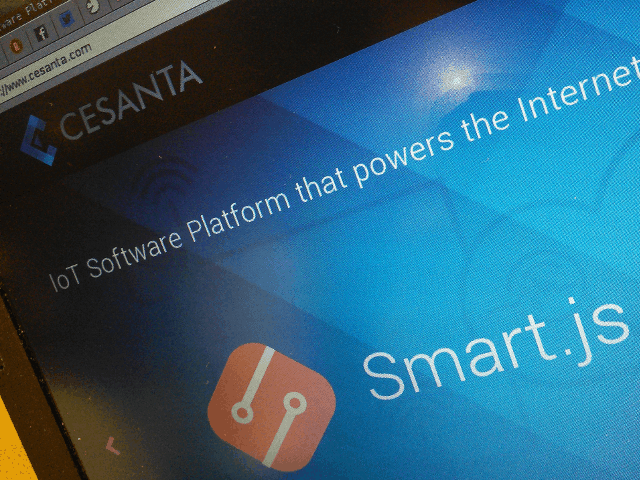
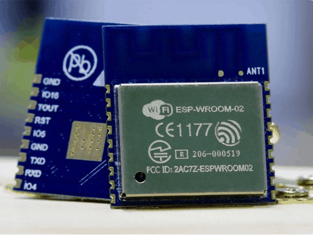
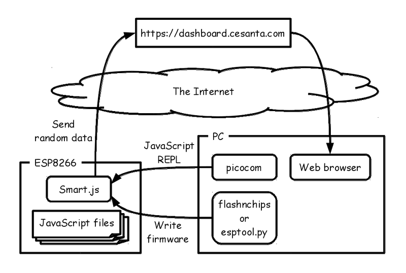
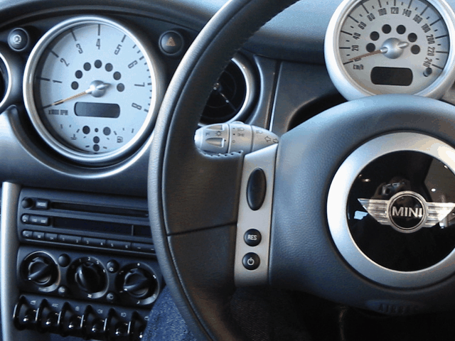
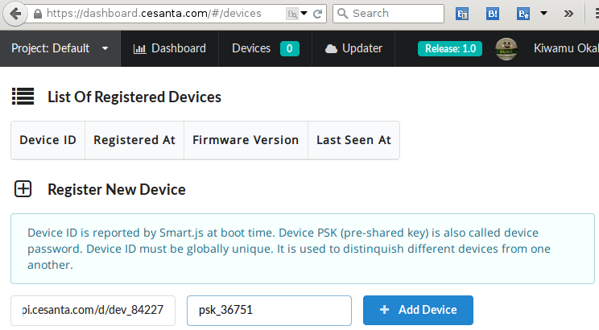
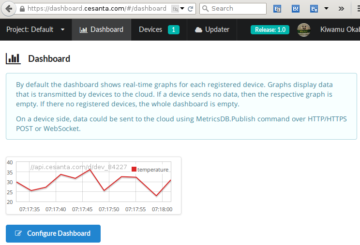
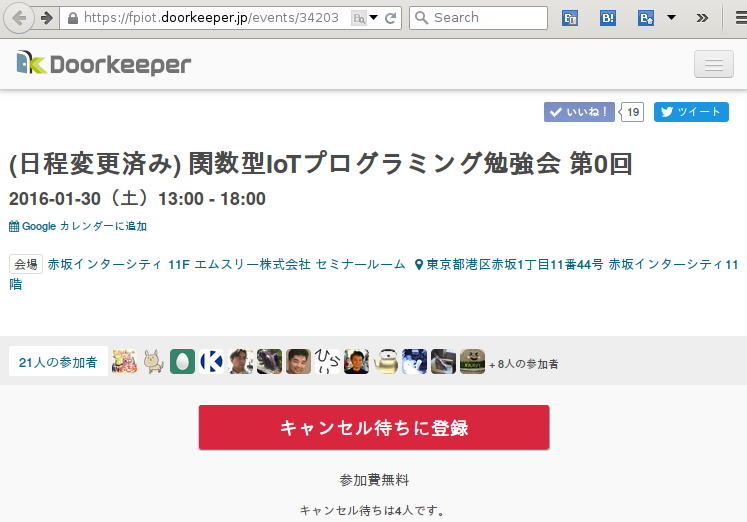

# Smart.js: JavaScript engine running on tiny MCU


Kiwamu Okabe

# ESP8266 hardware


* http://espressif.com/en/products/wroom/
* 32-bit low power MCU Wi-Fi Module
* Having integrated TCP/IP network stacks
* Including ADC, SDIO, UART, PWM, I2C ...
* Small form factor of only 18mm x 20mm

# Smart.js


```
https://www.cesanta.com/developer/smartjs
```



# Write Smart.js firmware


Download flashnchips-win.zip from https://github.com/cesanta/smart.js/releases, and write the firmware into ESP8266 using esptool.py https://github.com/themadinventor/esptool.

```
$ unar flashnchips-win.zip
$ cd flashnchips-win/firmware/ESP8266/Smart.js
$ esptool.py --baud 115200 --port /dev/ttyUSB0 write_flash 0x00000 0x00000.bin 0x11000 0x11000.bin 0x6d000 0x6d000.bin
```

# JavaScript REPL on terminal


```
$ picocom -b 115200 --omap crcrlf /dev/ttyUSB0
Device id: //api.cesanta.com/d/dev_84227 
Device psk: psk_36751 
Cloud: //api.cesanta.com 
HELO! Type some JS. See https://github.com/cesanta/smart.js for more info. 

smartjs 28904/2256$ 1+1
2
smartjs 28904/2256$ 1+"hoge"
1hoge
smartjs 29184/2256$ File.list(".")
["cloud.js","clubby.js","demo.js","gpio.js","I2C.js","MC24FC.js","MC24FC_test.js","MCP9808.js","MCP9808_test.js","MPL115A1.js","smart.js","swupdate.js","sys_rts.js","user.js","sys_config.json"]
```

# Connect dashboard.cesanta.com




# Send random data from ESP8266


```
$ picocom -b 115200 --omap crcrlf /dev/ttyUSB0
smartjs 29032/2268$ Wifi.setup('XXXXXXXXXXXXX','YYYYYYYYYY')
true
smartjs 29208/2376$ Wifi.ip()
192.168.179.3
smartjs 29016/2280$ Wifi.status()
got ip
smartjs 29112/2280$ demo()
Initializing demo data source
Starting temperature push demo in background, type Debug.mode(1) to see activity
undefined
```

# Watch dashboard.cesanta.com




# Other products by Cesanta Software


```
* Mongoose: Net library supporting TLS/HTTP/Websocket/JSON-RPC/MQTT/CoAP/DNS
  https://github.com/cesanta/mongoose
* V7: JavaScript engine deployed in two files v7.h and v7.c
  https://github.com/cesanta/v7
* Frozen: JSON parser and generator
  https://github.com/cesanta/frozen/
* SLRE: Regular Expression library
  https://github.com/cesanta/slre/
* Krypton: TLS/DTLS library, source and binary compatible OpenSSL subset
  https://github.com/cesanta/krypton
* Flashnchips: Firmware writer for Windows and Mac OS X
  https://github.com/cesanta/smart.js/tree/master/flashnchips
* GDB server: Debugger stub for remote debug
  https://github.com/cesanta/smart.js/tree/master/platforms/esp8266#gdb
* SPIFFS: SPI Flash File System (not Cesanta product)
  https://github.com/pellepl/spiffs
```

# PR: Join the Functional IoT Meetup!



