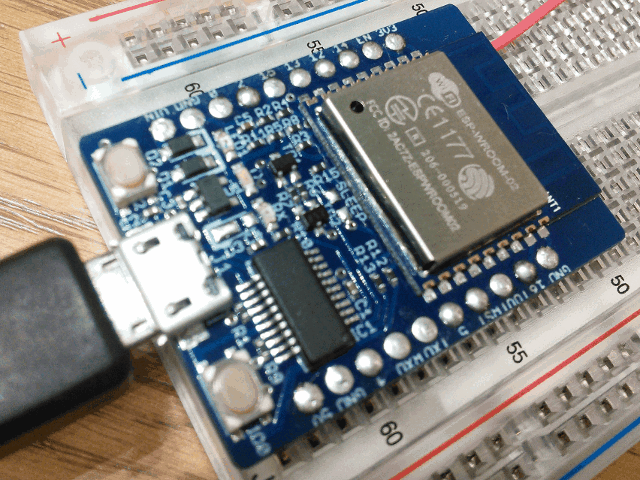
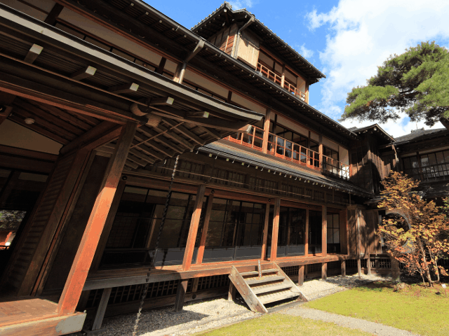
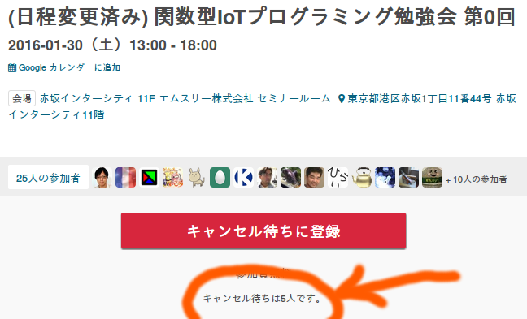

# Safe IoT using functional language


Kiwamu Okabe @ RIKEN AICS

# Hardware: ESP8266


* http://espressif.com/en/products/wroom/
* 32-bit low power MCU Wi-Fi Module
* Having integrated TCP/IP network stacks
* Including ADC, SDIO, UART, PWM, I2C ...
* Small form factor of only 18mm x 20mm

# Functional language: ATS


* http://www.ats-lang.org/
* Syntax like ML
* DML-style dependent types
* Linear types
* Optional GC
* Optional malloc/free
* Optional run-time

# Demo


The code is found at following:

https://github.com/fpiot/esp8266-ats

# Demo environment


# Software architecture



# ATS finds forgetting free memory


```
$ cd esp8266-ats/ifttt_ats
$ vi user/user_main.dats
 39     val json_open = string0_copy "{\"value1\": \""
 40     val json_close = string0_copy "\" }"
 41     val temp = esp_tostrptr_int rand
 42     val json_head = strptr_append (json_open, temp)
 43     val json_data = strptr_append (json_head, json_close)
 44 //  val () = (free json_open; free json_close; free temp; free json_head)
 45     val () = (free json_open; free json_close; free temp) // Error!
$ make
ATS user/user_main.dats
/home/kiwamu/src/esp8266-ats/ifttt_ats/user/user_main.dats: 985(line=32, offs=43) -- 2237(line=55, offs=4): error(3): the linear dynamic variable [json_head$3823(-1)] needs to be consumed but it is preserved with the type [S2Eapp(S2Ecst(strptr_addr_vtype); S2EVar(4441))] instead.
```

# Functional IoT Meetup at January 30




# License of photos


```
* About time I had a whisky glass! | Flickr - Photo Sharing!
  https://www.flickr.com/photos/toolmantim/14834817323/
  Copyright: Tim Lucas / License: CC BY 2.0
* Japanese traditional style house design / 和風建築(わふうけんちく) | Flickr - Photo Sharing!
  https://www.flickr.com/photos/tanaka_juuyoh/10720411936/
  Copyright: TANAKA Juuyoh (田中十洋) / License: CC BY 2.0
* Undirected member-get-member network | Flickr - Photo Sharing!
  https://www.flickr.com/photos/porternovelli/2587018053/
  Copyright: Porter Novelli Global / License: CC BY-SA 2.0
* JTAG board 1 | Flickr - Photo Sharing!
  https://www.flickr.com/photos/amagill/2877921712/
  Copyright: Andrew Magill / License: CC BY 2.0
* Creative Commons BBB | Flickr - Photo Sharing!
  https://www.flickr.com/photos/steren/2732488224/
  Copyright: Steren Giannini / License: CC BY 2.0
```
