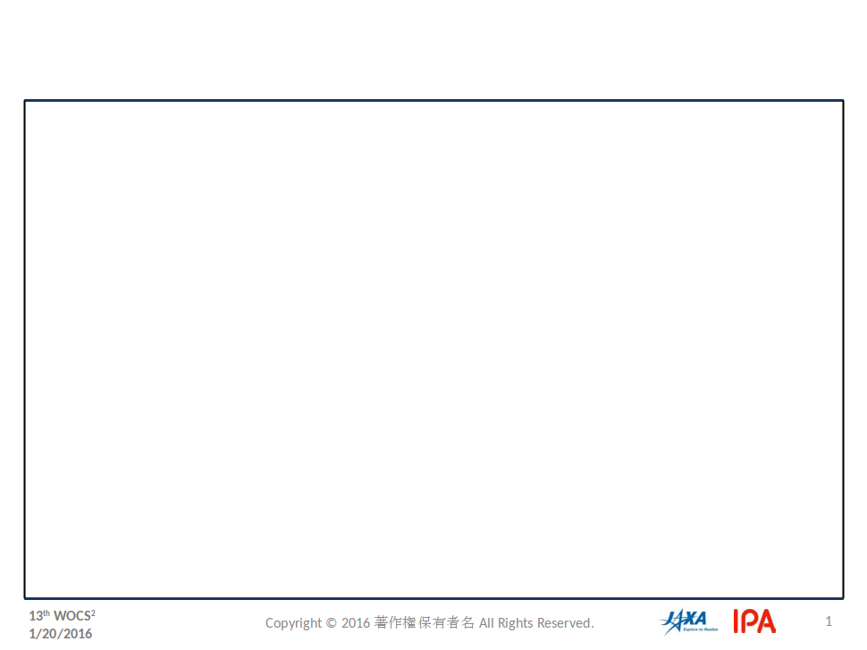
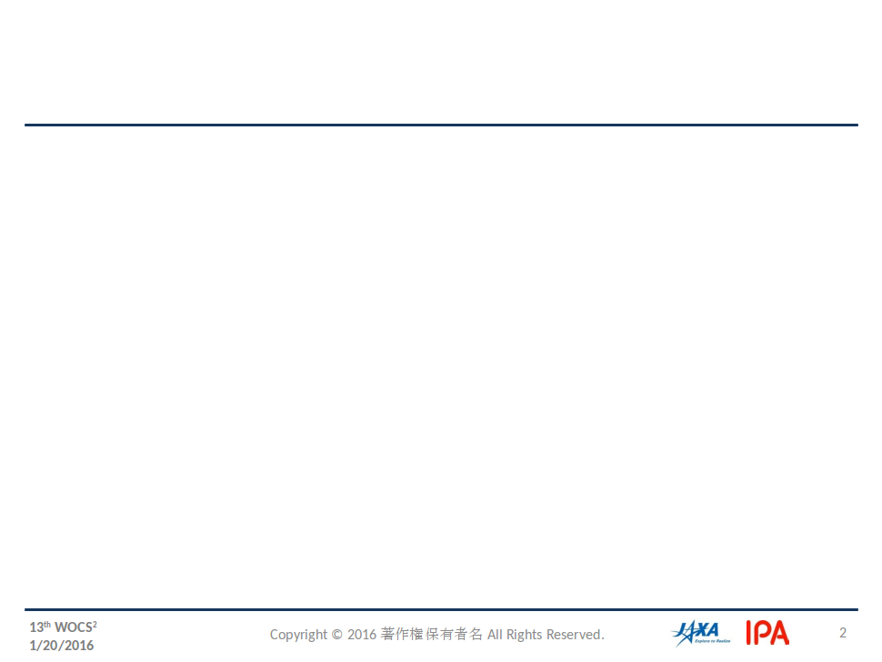
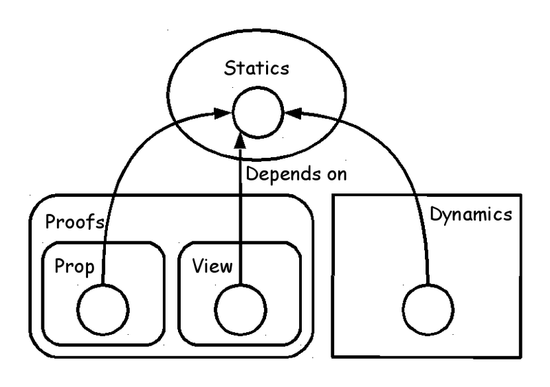
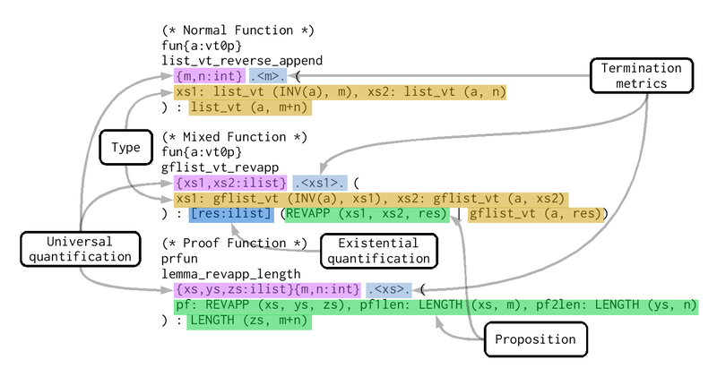

# Embedded application designed by ATS language


Kiwamu Okabe @ RIKEN AICS

# Remember Heartbleed bug?


Should we use safer language than C?

~~~
== In English ==
"Preventing heartbleed bugs with safe programming languages"
http://bluishcoder.co.nz/2014/04/11/preventing-heartbleed-bugs-with-safe-languages.html
== In Japanease ==
"安全なプログラミング言語を使って heartbleed を防ぐには"
https://github.com/jats-ug/translate/blob/master/Web/bluishcoder.co.nz/2014/04/11/preventing-heartbleed-bugs-with-safe-languages.md
~~~

"A safer systems programming language could have prevented the bug."

# Want the safer language... It's ATS!


* http://www.ats-lang.org/
* Syntax like ML
* DML-style dependent types
* Linear types
* Optional GC
* Optional malloc/free
* Optional run-time

# Agenda


* [1] Demo
* [2] ATS language basics
* [3] Prop (proof) on ATS
* [4] View (linear type) on ATS
* [5] Compare ATS with the other
* [6] Conclusion

# [1] Demo: ATS application on ESP8266


https://github.com/fpiot/esp8266-ats


# ESP8266 hardware


* http://espressif.com/en/products/wroom/
* 32-bit low power MCU Wi-Fi Module
* ROM: 4 MB
* RAM: 50 KB

# What error can be captured by ATS?


```
$ vi user/user_main.dats
 39     val json_open = string0_copy "{\"value1\": \""
 40     val json_close = string0_copy "\" }"
 41     val temp = esp_tostrptr_int rand
 42     val json_head = strptr_append (json_open, temp)
 43     val json_data = strptr_append (json_head, json_close)
 44 //  val () = (free json_open; free json_close; free temp; free json_head)
 45     val () = (free json_open; free json_close; free temp) // Error!
$ make
ATS user/user_main.dats
/home/kiwamu/src/esp8266-ats/ifttt_ats/user/user_main.dats: 985(line=32, offs=43) -- 2237(line=55, offs=4): error(3): the linear dynamic variable [json_head$3823(-1)] needs to be consumed but it is preserved with the type [S2Eapp(S2Ecst(strptr_addr_vtype); S2EVar(4441))] instead.
patsopt(TRANS3): there are [1] errors in total.
```

# Demo: ATS application on Arduino Uno


https://github.com/fpiot/arduino-ats


# Arduino Uno hardware


* https://www.arduino.cc/en/Main/ArduinoBoardUno
* 8-bit Harvard architecture
* ROM: 32 KB
* RAM: 2 KB

# What error can be captured by ATS?


```
$ vi ../../SATS/lcd.sats
 11 fun lcd_print {n:int}{i:nat | i < n}{j:nat | i + j <= n}
 12 (lcd: !lcd_t, str: string (n), start: size_t (i), len: size_t (j)): void
$ vi DATS/main.dats
 14   fun loop {n:int}{i:nat | i < n} .<n-i>.
 15            (lcd: !lcd_t, str: string (n), pos: size_t (i)): void = {
 16 //  val () = if pos + i2sz LCD_WIDTH <= length str then {
 17     val () = if pos + i2sz LCD_WIDTH <= 1 + length str then { // Error!
 --snip--
 19       val () = (lcd_setCursor (lcd, 0, 1);
 20                 lcd_print (lcd, str, pos, i2sz LCD_WIDTH))
$ patsopt -o DATS/main_dats.c.tmp -d DATS/main.dats
/home/kiwamu/src/arduino-ats/demo/lcd_greeting/DATS/main.dats: 1016(line=20, offs=26) -- 1016(line=20, offs=26): error(3): unsolved constraint: C3NSTRprop(C3TKmain(); S2Eapp(S2Ecst(<=); S2Eapp(S2Ecst(+); S2EVar(1969->S2Evar(i(5685))), S2EVar(1970->S2Eintinf(16))), S2EVar(1968->S2Evar(n(5684)))))
```

# [2] ATS language basics




# Dynamics: ML-style programming


* Dynamics of ATS is similar to Standard ML.
* You should represent type signature of function, because ATS can't inference everything.
* You should introduce main function, because ATS code is compiled into C language.

# Fizzbuzz on Standard ML


```
local
  fun fbstr i =
    case (i mod 3 = 0, i mod 5 = 0) of
        (true , true ) => "FizzBuzz"
      | (true , false) => "Fizz"
      | (false, true ) => "Buzz"
      | (false, false) => Int.toString i

  fun fizzbuzz' (n, j) =
    if n = j then ()
      else (print (fbstr j ^ "\n"); fizzbuzz' (n, j+1))
in
  fun fizzbuzz n = fizzbuzz' (n, 1)
  val _ = fizzbuzz 100
end
```

# Fizzbuzz on ATS


```
local
  fun fbstr (i:int): string =
    case (i mod 3 = 0, i mod 5 = 0) of
        (true , true ) => "FizzBuzz"
      | (true , false) => "Fizz"
      | (false, true ) => "Buzz"
      | (false, false) => tostring_int i

  fun fizzbuzz' (n:int, j:int): void =
    if n = j then ()
      else (println! (fbstr j); fizzbuzz' (n, j+1))
in
  fun fizzbuzz (n:int): void = fizzbuzz' (n, 1)
  val _ = fizzbuzz 100
end

implement main0 () = ()
```

# [3] Prop (proof) on ATS


* Type: Function signature introduced by keyword "fun"
* Program: Function body introduced by keyword "implement"
* Proposition: Proof function signature introduced by keyword "prfun"
* Proof: Proof function body introduced by keyword "primplement"

# Prop: Style of functions


# Prop: Function signature




# Prop: Function body


# Proof: Pros of mixed function


You can write following application:

* Program without garbage collection
* Proof to prove the program

Good news for low-level programming!

# Prop is similar to Coq


* Coq is an interactive theorem prover.
* ATS also has subsystem for theorem-proving.
* But ATS doesn't have tactics.
* ATS constructs proofs as total functions.

# Prop: Coq code


```
Inductive day : Type :=
  | monday : day
  | tuesday : day
  | wednesday : day
  | thursday : day
  | friday : day
  | saturday : day
  | sunday : day.

Inductive good_day : day -> Prop :=
  | gd_sat : good_day saturday
  | gd_sun : good_day sunday.

Theorem gds : good_day sunday.
Proof. apply gd_sun. Qed.
```

# Prop: ATS code


```
datasort Day =
  | Monday
  | Tuesday
  | Wednesday
  | Thursday
  | Friday
  | Saturday
  | Sunday

dataprop Good_Day (Day) =
  | Gd_Sat (Saturday) of ()
  | Gd_Sun (Sunday) of ()

extern prfun gds: Good_Day Sunday
primplement gds = Gd_Sun ()
```

Coq and ATS have same structure.

# [4] View (linear type) on ATS
# [5] Compare ATS with the other
# Compare ATS with Event-B
# Compare ATS with VeriFast
# Compare ATS with Xmos
# [6] Conclusion
