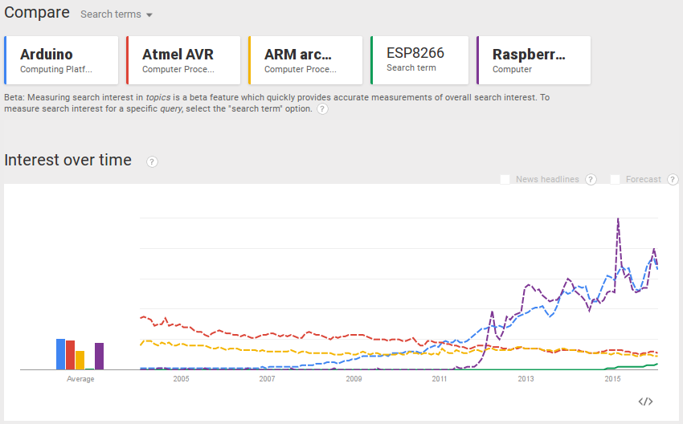

# Functional IoT: Hardware and Platform

Kiwamu Okabe

# Hardware for hobby programmer

* Industrial programmer chooses closed platform.
* But we are hobby programmer who loves open platform.
* Example of open platform is GCC, Arduino and etc.
* Let's take a look such open platform.

# Hardware and Platform

Which layer do you write using your language?


# Arduino (compatible board)

* CPU: AVR (8-bit)
* Compiler: GCC / Middleware: open source
* Network: Ethernet / C++ middleware
* Development board: 6.90 + 5.95 = US $12.85

```
https://www.arduino.cc/
http://www.aliexpress.com/item/new-Starter-Kit-UNO-R3-mini-Breadboard-LED-jumper-wire-button-for-Arduino-compatile-free-shipping/2050828592.html
http://www.aliexpress.com/item/UNO-Shield-Ethernet-Shield-W5100-R3-UNO-Mega-2560-1280-328-UNR-R3-only-W5100-Development/1571438805.html
```

# MSP430

* CPU: MSP430 (16-bit)
* Compiler: GCC / Middleware: open source
* No network support
* Development board: US $9.99

```
http://ti.com/launchpad
https://github.com/pabigot/bsp430
```

# Pinguino

* CPU: PIC18 (8-bit) / PIC32 (32-bit)
* Compiler: SDCC
* No network support
* Development board: 950 + 4500 = ￥5450

```
http://pinguino.cc/
http://sdcc.sourceforge.net/
http://akizukidenshi.com/catalog/g/gK-08010/
http://akizukidenshi.com/catalog/g/gM-03608/
```

# mbed

* CPU: Cortex-M (32-bit)
* Compiler: GCC / RTOS: open source
* Network: Ethernet / Big C++ middleware
* Development board: US $39.95

```
https://developer.mbed.org/
http://www.seeedstudio.com/depot/Arch-Max-CortexM4-based-Mbed-enable-development-board-p-2201.html
```

# FreeRTOS

* CPU: MSP430, Cortex-M, ARM7, RX, PowerPC, etc.
* Compiler: GCC / RTOS: open source
* Network: Ethernet / Doesn't have gool HAL?
* There are many forks.
* Development board: ￥7500

```
http://www.freertos.org/
https://github.com/sorrowed/STM32-F7-Ethernet-emWin
http://akizukidenshi.com/catalog/g/gM-09880/
```

# ChibiOS/RT

* CPU: AVR (8-bit), Cortex-M (32-bit)
* Compiler: GCC / RTOS: open source
* Network: Ethernet / Tiny RTOS supports HAL
* Development board: ￥7500

```
http://www.chibios.org/
http://akizukidenshi.com/catalog/g/gM-09880/
```

# chopstx

* CPU: Cortex-M (32-bit / No MMU)
* Compiler: GCC / RTOS: open source
* No network support / Tiny thread library
* Development board: 10 + 2.74 + 6.90 = US $19.64

```
http://git.gniibe.org/gitweb/?p=chopstx/chopstx.git
http://www.seeedstudio.com/depot/FSM55-LED-Matrix-Display-p-2121.html
http://www.aliexpress.com/item/Free-Shipping-1SET-ST-Link-st-link-V2-for-STM8S-STM8L-STM32-Cortex-M0-Cortex-M3/1619197946.html
```

# ESP8266

* CPU: Xtensa lx106 (32-bit / No MMU)
* Compiler: GCC / RTOS: closed source
* Network: Wi-Fi
* Development board: ￥2160

```
http://www.esp8266.com/
https://www.switch-science.com/catalog/2500/
```

# ToCoNet (Jennic)

* CPU: OpenRISC 1200 (32-bit / No MMU)
* Compiler: GCC / RTOS: open source?
* Network: IEEE802.15.4 (ZigBee)
* Development board: 1620 + 2430 = ￥4050

```
http://mono-wireless.com/
http://akizukidenshi.com/catalog/g/gK-06759/
http://akizukidenshi.com/catalog/g/gM-08264/
```

# Raspberry Pi

* CPU: ARM11 or Cortex-A (32-bit / with MMU)
* Compiler: GCC, LLVM, etc
* Network: Ethernet / Wi-Fi (USB dongle)
* Development board: US $25 (1 Model B+)

```
https://www.raspberrypi.org/
```

# Trends


