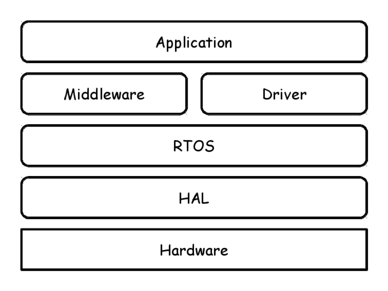

# Functional IoT: Hardware and Environment

Kiwamu Okabe

# Hardware and Environment

Which layer do you write using your language?

# Hardware: ARM Cortex-M

* CPU: 32-bit / No MMU
* RAM: 4 - 384 kB
* Compiler: GCC, LLVM

# Hardware: AVR

* CPU: 8-bit / Harvard architecture
* RAM: 32 byte - 32 kB
* Compiler: GCC, LLVM

# Hardware: MSP480

* CPU: 16-bit
* RAM: 2 - 4 kB
* Compiler: 

# Hardware: PIC18

* CPU: 8-bit
* RAM: 256 byte - 32 kB

# Middleware: Arduino
# Middleware: Pinguino
# RTOS: mbed
# RTOS: ESP8266
# RTOS: ToCoNet
# RTOS: FreeRTOS
# RTOS: ChibiOS/RT
# RTOS: chopstx
# RTOS: eCos
# RTOS: TOPPERS
