# Functional IoT: Programming Language and OS
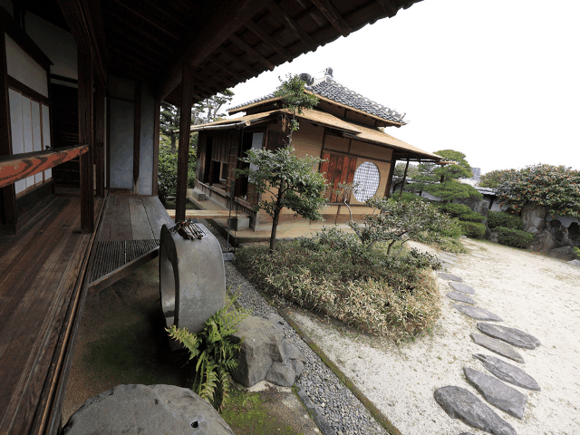

Kiwamu Okabe

# We drown in MANY MANY languages!


* There are many many languages in the world.
* Nobody have the exhaustive catalog of them.
* However, let's try to get first overview today.

# What the purpose of language?
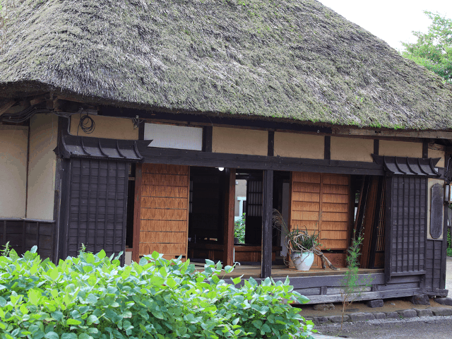

I think that there are three major purpose of the languages:

* Implementation
* Verification
* OS

# - Implementation -
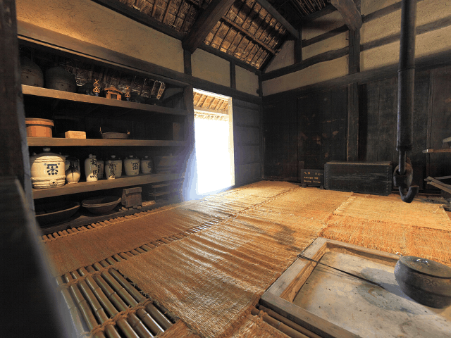


# ATS


* http://www.ats-lang.org/
* Without GC / Without runtime
* Theorem proving / Safely use pointer
* Syntax is similar to ML
* Compiled into C language code
* Able to import C define macro

# ATS on ESP8266


* https://github.com/fpiot/esp8266-ats


# What error can be captured by ATS?


```
$ vi user/user_main.dats
 39     val json_open = string0_copy "{\"value1\": \""
 40     val json_close = string0_copy "\" }"
 41     val temp = esp_tostrptr_int rand
 42     val json_head = strptr_append (json_open, temp)
 43     val json_data = strptr_append (json_head, json_close)
 44 //  val () = (free json_open; free json_close; free temp; free json_head)
 45     val () = (free json_open; free json_close; free temp) // Error!
$ make
ATS user/user_main.dats
/home/kiwamu/src/esp8266-ats/ifttt_ats/user/user_main.dats: 985(line=32, offs=43) -- 2237(line=55, offs=4): error(3): the linear dynamic variable [json_head$3823(-1)] nee
ds to be consumed but it is preserved with the type [S2Eapp(S2Ecst(strptr_addr_vtype); S2EVar(4441))] instead.
```

# ATS on Arduino


* https://github.com/fpiot/arduino-ats


# What error can be captured by ATS?


```
$ vi ../../SATS/lcd.sats
 11 fun lcd_print {n:int}{i:nat | i < n}{j:nat | i + j <= n}
 12 (lcd: !lcd_t, str: string (n), start: size_t (i), len: size_t (j)): void
$ vi DATS/main.dats
 14   fun loop {n:int}{i:nat | i < n} .<n-i>.
 15            (lcd: !lcd_t, str: string (n), pos: size_t (i)): void = {
 16 //  val () = if pos + i2sz LCD_WIDTH <= length str then {
 17     val () = if pos + i2sz LCD_WIDTH <= 1 + length str then { // Error!
 --snip--
 19       val () = (lcd_setCursor (lcd, 0, 1);
 20                 lcd_print (lcd, str, pos, i2sz LCD_WIDTH))
 21       val () = loop (lcd, str, pos + 1)
$ patsopt -o DATS/main_dats.c.tmp -d DATS/main.dats |& pats-filter
DATS/main.dats:20:26: unsolved constraint: [1]
[1]: ((S2EVar(1969 -> i) + S2EVar(1970 -> 16)) <= S2EVar(1968 -> n))
```

# Rust


* https://www.rust-lang.org/
* Without GC
* Syntax is similar to C
* Safely use pointer
* Depends on LLVM

# Rust on mbed


* https://github.com/0xc0170/mbed-rust-frdm-k64f-blinky


# Jhc


* http://repetae.net/computer/jhc/
* A Haskell compiler
* With GC
* Only for 32-bit CPU
* Can't use all of Haskell libraries
* Compiled into C language code

# Jhc on mbed


* https://github.com/ajhc/demo-cortex-m3


# Ivory


* http://ivorylang.org/
* EDSL on Haskell
* Without GC
* No NULL pointer
* Compiled into C language code

# Ivory on Arduino


* https://github.com/fpiot/arduino-ivory


# Idris


* http://www.idris-lang.org/
* With GC
* Theorem proving
* Syntax is similar to Haskell
* Compiled into C language code

# Idris on Arduino


* https://github.com/stepcut/idris-blink
* Eat much memory. Following crash.

```
main = do pinMode 13 1
          digitalWrite 13 1
          delay 100
          digitalWrite 13 0
          delay 100
          digitalWrite 13 1
          delay 100
          digitalWrite 13 0
          delay 100
          digitalWrite 13 1
          delay 100
```

# Ada
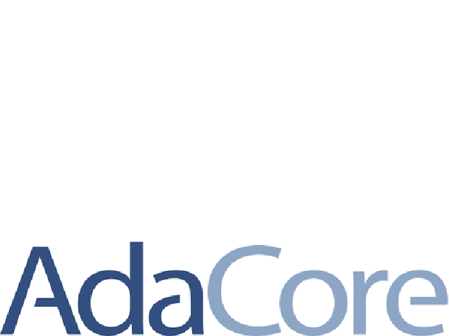

* http://www.adacore.com/
* Without GC
* Verification with SPARK
* Ada on Arduino
* http://playground.arduino.cc/Code/AVR-Ada

# Hexe


* http://haxe.org/
* Can run on bare metal hardware?

# - Verification -
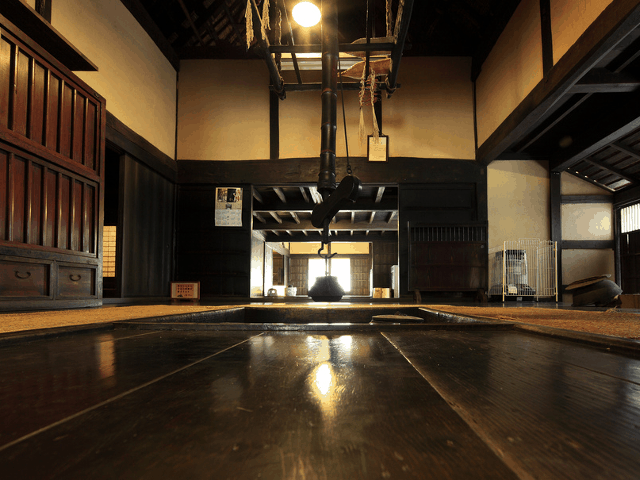


# VeriFast
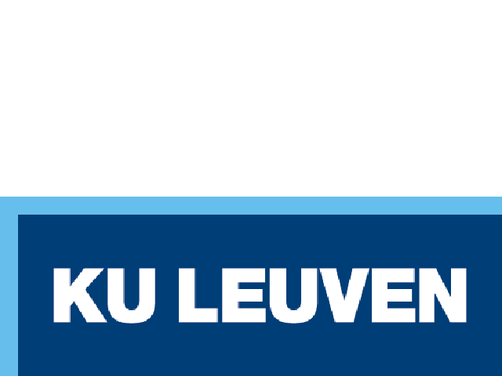

* http://people.cs.kuleuven.be/~bart.jacobs/verifast/
* Design by contract (DbC) in C language comment
* preconditions, postconditions, invariants
* Can prove code with lemma function?

# VeriFast on Arduino


* https://github.com/fpiot/arduino-verifast


# Coq


* https://coq.inria.fr/
* Theorem prover
* Semi-automatic proving with tactics
* Extract code into implementation with GC
* Good document: http://proofcafe.org/sf-beta/

# Isabelle/HOL
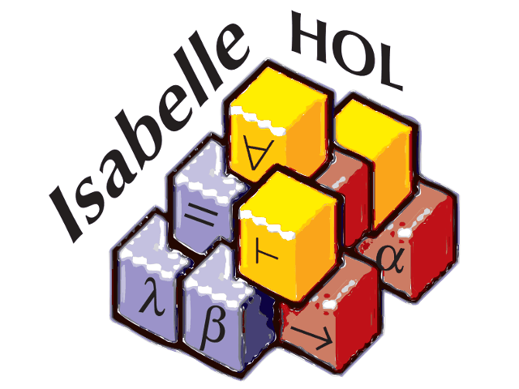

* https://isabelle.in.tum.de/
* Theorem prover

# Alloy
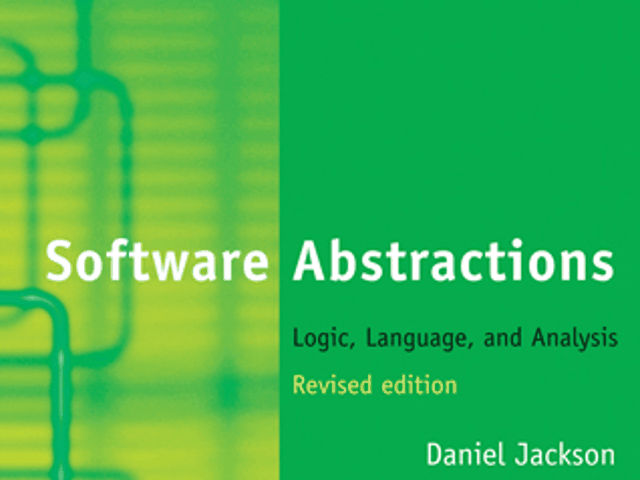

* http://alloy.mit.edu/
* A tool to analyze specifications
* Write specification as first-order predicate logic
* Find example instance on specification
* Find counter-example on specification
* Support abductive reasoning

# ACSL (Frama-C)
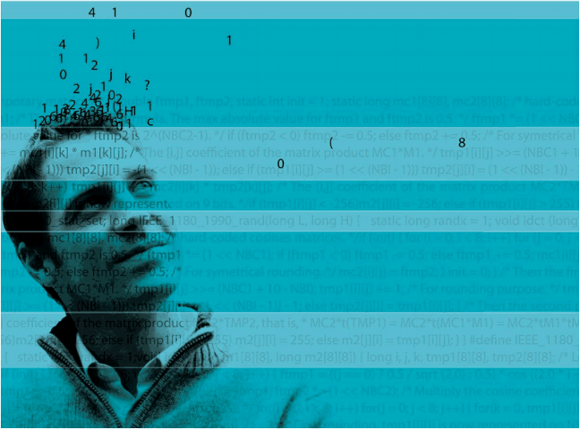

* http://frama-c.com/acsl.html
* Specification language for C programs
* Design by contract (DbC) in C language comment

# CBMC


* http://www.cprover.org/cbmc/
* Bounded Model Checker for C and C++
* Verify array bounds (buffer overflows), pointer safety, ex­cep­tions and user-specified assertions

# - OS -
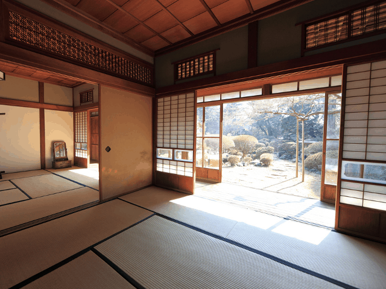

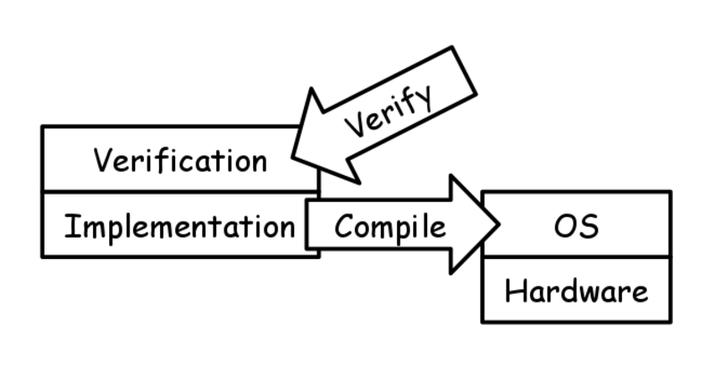

# seL4 microkernel
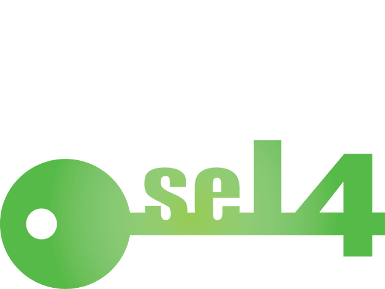

* https://sel4.systems/
* L4 microkernel verified by Isabelle/HOL
* CPU: ARM11, Cortex-A, x86
* Support multicore
* Can't safely use DMA
* Binary code level verification!

# Structure of seL4


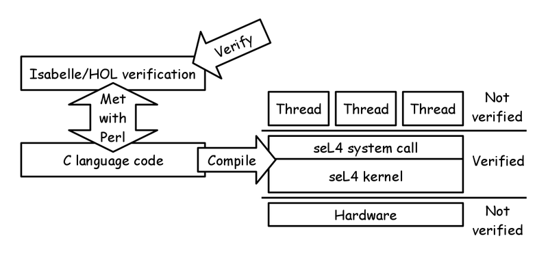

# How to verify seL4? #1


```
# Detail: https://github.com/seL4/l4v
$ sudo apt-get install python-pip python-dev libxml2-utils python-tempita python-psutil openjfx openjdk-8-jdk
$ export ISABELLE_JDK_HOME=/usr/lib/jvm/java-8-openjdk-amd64/
$ mkdir seL4_verify
$ cd seL4_verify
$ repo init -u https://github.com/seL4/verification-manifest.git
$ repo sync
$ ls
HOL4/  graph-refine/  isabelle/  l4v/  seL4/
$ cd l4v
$ mkdir -p ~/.isabelle/etc
$ cp -i misc/etc/settings ~/.isabelle/etc/settings
$ ./isabelle/bin/isabelle components -a
$ ./isabelle/bin/isabelle jedit -bf
$ ./isabelle/bin/isabelle build -bv HOL-Word
```

# How to verify seL4? #2


```
$ ./run_tests
Running 40 test(s)...

  running isabelle ...              pass      ( 0:00:05,  0.62GB)
  running CamkesAdlSpec ...         pass      ( 0:00:48,  3.52GB)
--snip--
  running AutoCorresTest ...        pass      ( 0:20:49,  6.93GB)
  running AutoCorresSEL4 ...        FAILED *  ( 2:00:59,  6.36GB)

------------------------------------------------------------------------
TEST FAILURE: AutoCorresSEL4
--snip--
AutoCorresSEL4: theory TestSEL4
*** Timeout
AutoCorresSEL4 FAILED
```

# How to compile and run seL4? #1


```
# Detail: http://sel4.systems/Info/GettingStarted/
$ sudo apt-get install git python build-essential realpath libxml2-utils python-tempita gcc-multilib ccache ncurses-dev cabal-install ghc libghc-missingh-dev libghc-split-dev python-pip python-jinja2 python-ply python-pyelftools libghc-data-ordlist-dev gcc-arm-none-eabi qemu
$ mkdir seL4_repo
$ cd seL4_repo
$ repo init -u https://github.com/seL4/sel4test-manifest.git
$ repo sync
$ ls -F
Kbuild@  Kconfig@  Makefile@  apps@  configs@  kernel/  libs/  projects/  tools/
$ make ia32_simulation_release_xml_defconfig
$ make
```

# How to compile and run seL4? #2


```
$ ls images
kernel-ia32-pc99*  sel4test-driver-image-ia32-pc99*
$ make simulate-ia32
qemu-system-i386 -m 512 -nographic -kernel images/kernel-ia32-pc99 -initrd images/sel4test-driver-image-ia32-pc99
--snip--
136/136 tests passed.
Ignoring call to sys_exit_group
Ignoring call to sys_rt_sigprocmask
Ignoring call to sys_gettid
Ignoring call to sys_getpid
sys_tgkill assuming self kill
```

# eChronos RTOS
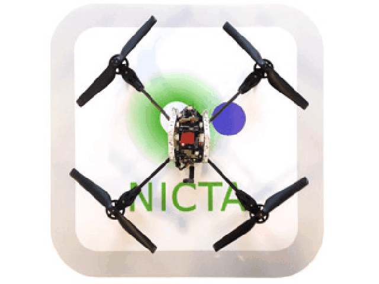

* http://ssrg.nicta.com.au/projects/TS/echronos/
* Embedded version of seL4
* Run without MMU
* not yet publish verification

# Redox


* http://www.redox-os.org/
* Desktop OS developed by Rust
* CPU: x86
* Support file system
* Support Ethernet (RTL8139)
* Support GUI and window system

# Mirage OS


* http://www.xenproject.org/developers/teams/mirage-os.html
* Cloud Operating System developed by OCaml
* Platform: Xen

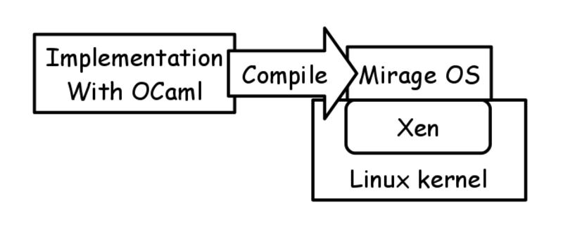

# AOS
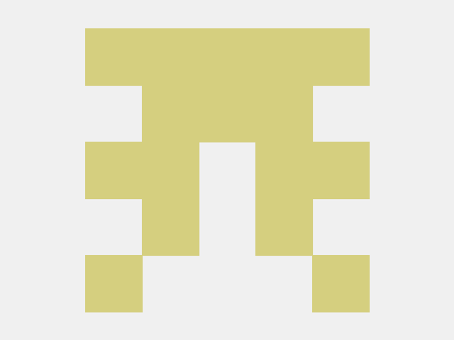

* https://github.com/xlq/aos
* Tiny OS developed by ATS
* CPU: x86
* Using own stream library

# What are you interested in?
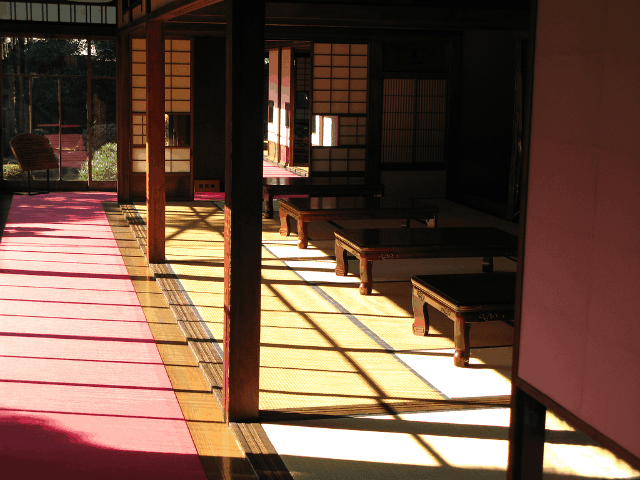

I'm personally interested in following:

* ATS
* Rust
* Ada
* VeriFast
* ACSL
* seL4

# License of photos #1


```
* Japanese traditional style SAMURAI house / 旧細川刑部邸(きゅうほそかわぎょうぶてい) | Flickr - Photo Sharing!
  https://www.flickr.com/photos/tanaka_juuyoh/3441295930/
  Copyright: TANAKA Juuyoh (田中十洋) / License: CC BY 2.0
* My son. My Lego. | Flickr - Photo Sharing!
  https://www.flickr.com/photos/38446022@N00/3912785418/
  Copyright: Josh Wedin / License: CC BY 2.0
* Japanese traditional style house / 大内宿(おおうちじゅく) | Flickr - Photo Sharing!
  https://www.flickr.com/photos/tanaka_juuyoh/3908054520/
  Copyright: TANAKA Juuyoh (田中十洋) / License: CC BY 2.0
* Japanese traditional style house interior design / 和風建築(わふうけんちく) | Flickr - Photo Sharing!
  https://www.flickr.com/photos/tanaka_juuyoh/5889056842/
  Copyright: TANAKA Juuyoh (田中十洋) / License: CC BY 2.0
```

# License of photos #2


```
* Japanese traditional style farm house / 古民家(こみんか) | Flickr - Photo Sharing!
  https://www.flickr.com/photos/tanaka_juuyoh/3633358136/
  Copyright: TANAKA Juuyoh (田中十洋) / License: CC BY 2.0
* Japanese traditional style house interior design / 和風建築(わふうけんちく) | Flickr - Photo Sharing!
  https://www.flickr.com/photos/tanaka_juuyoh/5420658494/
  Copyright: TANAKA Juuyoh (田中十洋) / License: CC BY 2.0
* Japanese old style house interior design / 和室(わしつ)の内装(ないそう) | Flickr - Photo Sharing!
  https://www.flickr.com/photos/tanaka_juuyoh/2092875176/
  Copyright: TANAKA Juuyoh (田中十洋) / License: CC BY 2.0
* Creative Commons BBB | Flickr - Photo Sharing!
  https://www.flickr.com/photos/steren/2732488224/
  Copyright: Steren Giannini / License: CC BY 2.0
```
