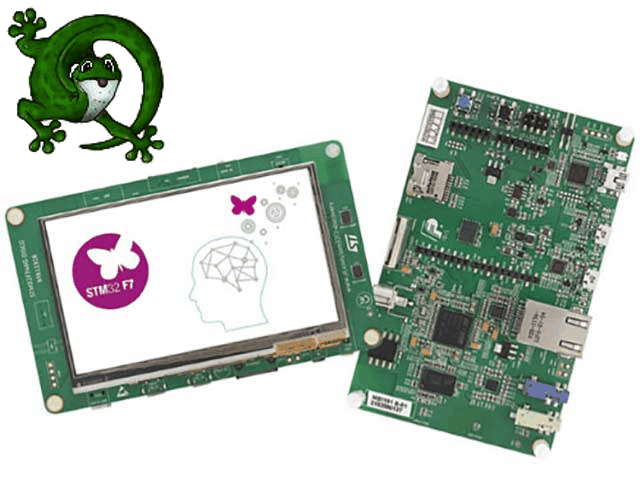
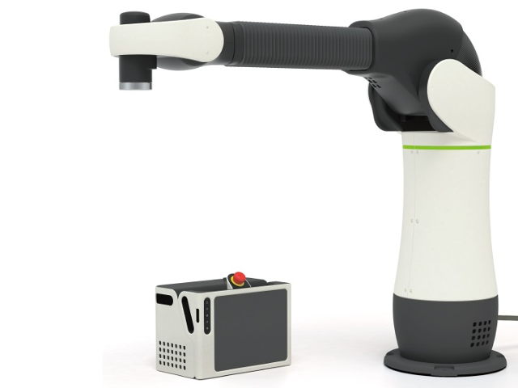

# Real-time OS system state captured by ATS language

Kiwamu Okabe

# Real-time OS: ChibiOS/RT


* http://www.chibios.org/
* Simple/Small/Fast/Portable real-time OS
* Run on ARM Cortex-M*, Arduino Uno, PowerPC e200
* Context Switch (STM32F4xx): 0.40 µsec
* Kernel Size (STM32F4xx): 6172 byte

# System state in ChibiOS/RT


# Class of system API

* "Normal" must be called on Thread
* "S-Class" must be called on S-Locked
* "I-Class" must be called on I-Locked or S-Locked
* "X-Class" must be called on Thread, S-Locked or I-Locked
* "Special" have special execution requirements
* "Object Initializers" can be used in any state

# Example: chSysLock()

* Special function
* Should be called on Thread state
* Change system state into S-Locked state

# Example: chVTSetI()

* I-Class API
* Should be called on I-Locked or S-Locked state
* Doesn't change system state

# Using system API in C


```
static void tmr_init(void *p) {
  chEvtObjectInit(&inserted_event);
  chEvtObjectInit(&removed_event);
  chSysLock();
  cnt = POLLING_INTERVAL;
  chVTSetI(&tmr, MS2ST(POLLING_DELAY), tmrfunc, p);
  chSysUnlock();
}
```

# Undefined behavior by miss calling!


```
static void tmr_init(void *p) {
  chEvtObjectInit(&inserted_event);
  chEvtObjectInit(&removed_event);
  chSysLockFromISR();
  cnt = POLLING_INTERVAL;
  chVTSetI(&tmr, MS2ST(POLLING_DELAY), tmrfunc, p);
  chSysUnlockFromISR();
}
```

* The code has no error at compile-time, but...
* it causes undefined behavior at run-time!

# ATS language


* http://www.ats-lang.org/
* Syntax is similar to ML
* DML-style dependent types / Linear types
* Theorem proving / Safely use pointer
* Without GC / Without runtime
* Compiled into C language code

# ATS programing on ChibiOS/RT

* https://github.com/fpiot/chibios-ats-2
* ATS code is found at following
* https://github.com/fpiot/chibios-ats-2/blob/master/demos/STM32/RT-STM32F746G-DISCOVERY-LWIP-FATFS-USB/main.dats

# Demo

xxx

# Define linear type for system state


```
#define chss_init       0
#define chss_thread     1
#define chss_irqsusp    2
#define chss_irqdisable 3
#define chss_irqwait    4
#define chss_isr        5
#define chss_slock      6
#define chss_ilock      7
absvtype chss(s:int)
vtypedef chss_any = [s:int | chss_init <= s; s <= chss_ilock] chss(s)
vtypedef chss_iclass = [s:int | s == chss_slock || s == chss_ilock] chss(s)
```

# Introduce wrapper for system API


```
extern fun chSysLock (!chss(chss_thread) >> chss(chss_slock) | ): void
  = "mac#"
extern fun chSysUnlock (!chss(chss_slock) >> chss(chss_thread) | ): void
  = "mac#"
extern fun chSysLockFromISR (!chss(chss_isr) >> chss(chss_ilock) | ): void
  = "mac#"
extern fun chSysUnlockFromISR (!chss(chss_ilock) >> chss(chss_isr) | ): void
  = "mac#"
extern fun chEvtBroadcastI (!chss_iclass | cPtr0(event_source_t)): void
  = "mac#"
extern fun chEvtObjectInit (!chss_any | cPtr0(event_source_t)): void = "mac#"
extern fun chVTSetI (!chss_iclass | cPtr0(virtual_timer_t), systime_t,
  vtfunc_t, cPtr0(BaseBlockDevice)): void = "mac#"
```

# Using system API in ATS


```
128 extern fun tmr_init (!chss(chss_thread) | ptr): void = "mac#"
129 implement tmr_init (pss | p) = {
130   val bbdp = $UN.cast{cPtr0(BaseBlockDevice)}(p)
131 
132   val () = chEvtObjectInit (pss | inserted_event_p)
133   val () = chEvtObjectInit (pss | removed_event_p)
134   val () = chSysLock (pss | )
135   extvar "cnt" = POLLING_INTERVAL
136   val () = chVTSetI (pss | tmr_p, MS2ST (POLLING_DELAY), tmrfunc, bbdp)
137   val () = chSysUnlock (pss | )
138 }
```

* Any function takes linear type as 1st argument

# If you call miss system API...


```
128 extern fun tmr_init (!chss(chss_thread) | ptr): void = "mac#"
129 implement tmr_init (pss | p) = {
130   val bbdp = $UN.cast{cPtr0(BaseBlockDevice)}(p)
131 
132   val () = chEvtObjectInit (pss | inserted_event_p)
133   val () = chEvtObjectInit (pss | removed_event_p)
134   val () = chSysLockFromISR (pss | )
135   extvar "cnt" = POLLING_INTERVAL
136   val () = chVTSetI (pss | tmr_p, MS2ST (POLLING_DELAY), tmrfunc, bbdp)
137   val () = chSysUnlockFromISR (pss | )
138 }
```

# ATS finds the error at compile-time!


```
$ patsopt -o build/obj/main.c -d main.dats
/home/kiwamu/src/chibios-ats-2/demos/STM32/RT-STM32F746G-DISCOVERY-LWIP-FATFS-USB/main.dats: 4617(line=134, offs=30) -- 4620(line=134, offs=33): error(3): unsolved constraint: C3NSTRprop(C3TKmain(); S2Eeqeq(S2Eintinf(1); S2Eintinf(5)))
```

* It means that ATS compiler can't solve Thread state (chss(chss_thread)) equals ISR state (chss(chss_isr)).

# PR: Join Life Robotics Inc.


* https://liferobotics.jp/career
* ソフトウエア エンジニア
* ジュニアソフトウエアエンジニア
* 社内システムエンジニア
* 検証エンジニア
* UIエンジニア
* サポートエンジニア

# PR: Dive into VeriFast!


* https://people.cs.kuleuven.be/~bart.jacobs/verifast/
* A verifier for single-threaded and multithreaded C and Java programs annotated with preconditions and postconditions written in separation logic.
* Next meetup at July 22 18:30 - 21:30
* https://fpiot.doorkeeper.jp/events/47626

# PR: Functional Ikamusume at C90!


* http://www.paraiso-lang.org/ikmsm/
* AlphaGo
* Real-time OS and ATS language
* Internal set theory
* 日曜日西ｆ32a
