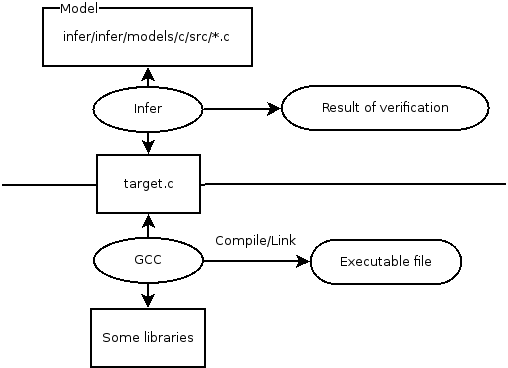
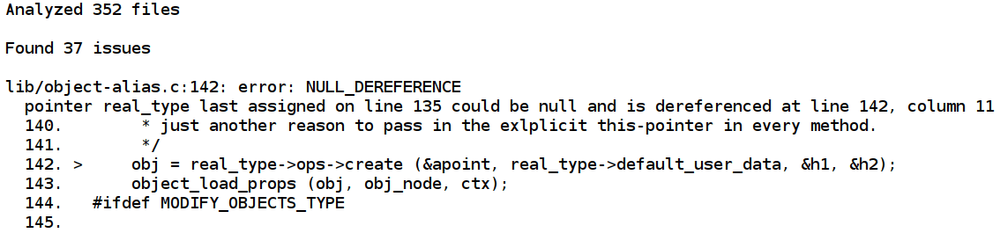
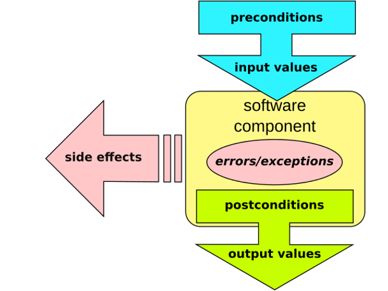
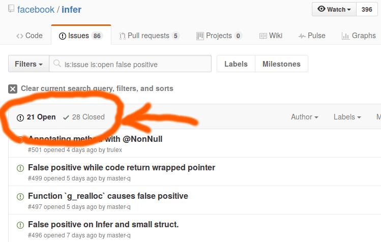

# Does Infer dream of design by contract?

Kiwamu Okabe

# What is Infer?

* http://fbinfer.com/
* Based on Separation logic.
* A static analysis tool that produces a list of potential bugs on Objective-C, Java, or C code.
* Such bugs are dereference null pointer, memory leaks and resource leaks.

# What doesn't Infer find?

* http://fbinfer.com/docs/limitations.html
* Array bounds errors
* Cast exceptions
* Leaking of tainted data
* Concurrency race conditions
* Arithmetic

# Infer has own model #1



# Infer has own model #2

```c
// File: infer/infer/models/c/src/libc_basic.c
// s1 and s2 must be allocated
// n must be between 0 and the minumum of the sizes of s1 and s2
void* memcpy(void* s1, const void* s2, size_t n) {
  int size_s1;
  int size_s2;
  __infer_set_flag("ignore_return",
                   ""); // no warnings if the return value is ignored
  __require_allocated_array(s1);
  size_s1 = __get_array_length(s1);
  __require_allocated_array(s2);
  size_s2 = __get_array_length(s2);
  INFER_EXCLUDE_CONDITION((n < 0) || (n > size_s1) || (n > size_s2));
  return s1;
}
```

# How to use Infer?

* Analyze a single C file:

```
$ infer -- gcc -c foo.c
```

* Analyze many C files with GNU make:

```
$ infer -- make
```

* For more detail, please read following:

```
http://d.hatena.ne.jp/eldesh/20160506/1462531099
```

# What result does Infer show?

```
$ git clone git://git.gnome.org/dia
$ cd dia
$ ./autogen.sh
$ infer -- make
--snip--
```



```
Detail: https://github.com/master-q/practice-infer/blob/master/infer_v0.9.4-e757d92_dia-e454097.log
```

# What is design by contract (DbC)?

* Inject pre/postcondition (contract) into code
* The program should stop if the contracts are violated at runtime



# Imagine to do DbC at compile-time #1

```c
// File: main.c
#include <unistd.h>
#include <sys/types.h>

#define __infer_assert(E) {  \
  int *s = NULL;             \
  if (!(E)) *s = 0xDEADBEEF; \
}

int main() {
        uid_t id;
        id = getuid();
        __infer_assert(id >= 1);
}
```

# Imagine to do DbC at compile-time #2

```
$ infer -- gcc -c main.c
--snip--
Found 1 issue

main.c:12: error: NULL_DEREFERENCE
  pointer s last assigned on line 12 could be null and is dereferenced at line 12, column 2
  10.           uid_t id;
  11.           id = getuid();
  12. >         __infer_assert(id >= 1);
  13.   }
  14.   

Summary of the reports

  NULL_DEREFERENCE: 1
```

# Let's capture invariant using DbC #1

There is BSD's queue.h:

```c
#define QUEUEDEBUG_LIST_INSERT_HEAD(head, elm, field)                   \
        if ((head)->lh_first &&                                         \
            (head)->lh_first->field.le_prev != &(head)->lh_first)       \
                QUEUEDEBUG_ABORT("LIST_INSERT_HEAD %p %s:%d", (head),   \
                    __FILE__, __LINE__);

#define LIST_INSERT_HEAD(head, elm, field) do {                         \
        QUEUEDEBUG_LIST_INSERT_HEAD((head), (elm), field)               \
        if (((elm)->field.le_next = (head)->lh_first) != LIST_END(head))\
                (head)->lh_first->field.le_prev = &(elm)->field.le_next;\
        (head)->lh_first = (elm);                                       \
        (elm)->field.le_prev = &(head)->lh_first;                       \
} while (/*CONSTCOND*/0)
```

# Let's capture invariant using DbC #2

Then we can do that?

```c
void mylist_insert_head(struct mylist_head *head, struct mylist_entry *elm) {
        __infer_assert(!(
                    (head)->lh_first &&
                    (head)->lh_first->link.le_prev != &(head)->lh_first
                )) /* Precondition on DbC */
        LIST_INSERT_HEAD(head, elm, link);
}
```

```
Detail: https://github.com/master-q/practice-infer/tree/master/bsd_queue2
```

# But it's not easy... #1

```
$ cat main.c
struct mylist_entry {
        LIST_ENTRY(mylist_entry) link;
        int val;
};
LIST_HEAD(mylist_head, mylist_entry) g_mylist_head =
    LIST_HEAD_INITIALIZER(mylist_head);
--snip--
int main() {
        struct mylist_entry e1;
        mylist_insert_head(&g_mylist_head, &e1);
}
```

# But it's not easy... #2

```
$ infer -- gcc -c main.c
Found 1 issue

main.c:20: error: NULL_DEREFERENCE
  pointer s last assigned on line 20 could be null and is dereferenced at line 20, column 2
  18.   void mylist_insert_head(struct mylist_head *head, struct mylist_entry *elm) {
  19.           __infer_assert(!(
  20. >                     (head)->lh_first &&
  21.                       (head)->lh_first->link.le_prev != &(head)->lh_first
  22.   
--snip--
```

# False positive/negative

* Infer doesn't correctly find bugs.
* False positive: find trouble-free issue as bug.
* False negative: doesn't find trouble issue as bug.

# Infer may cause false positive/negative



# How about Coverity?

* http://www.coverity.com/
* Not open source.
