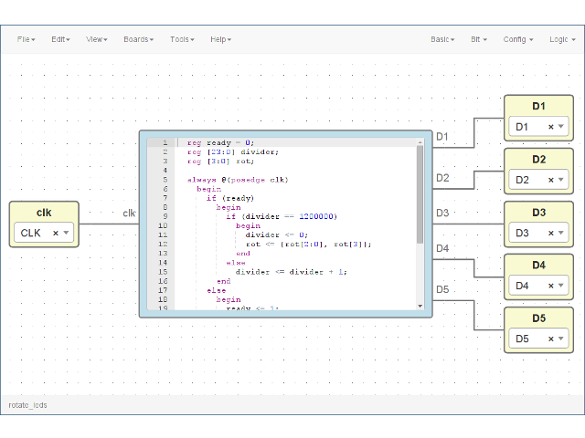
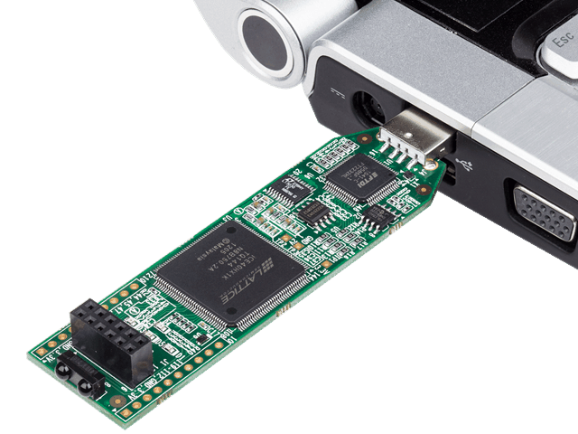
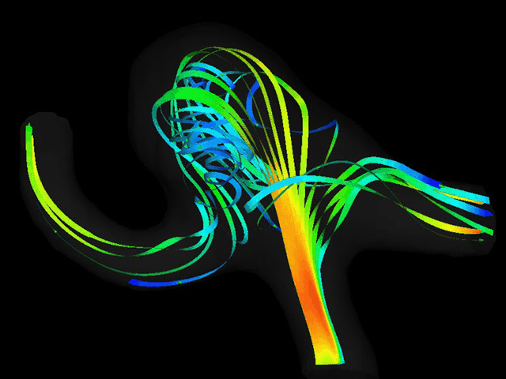
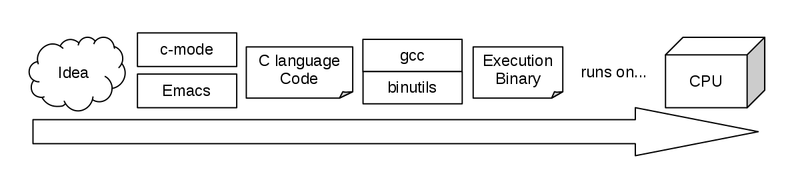
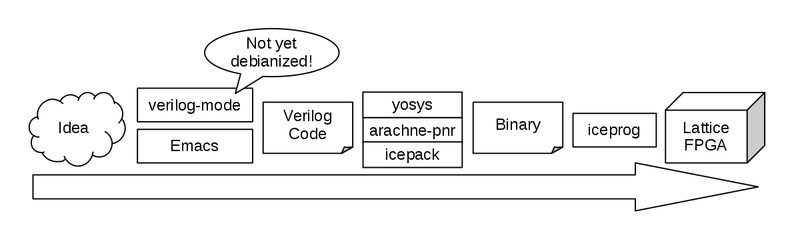
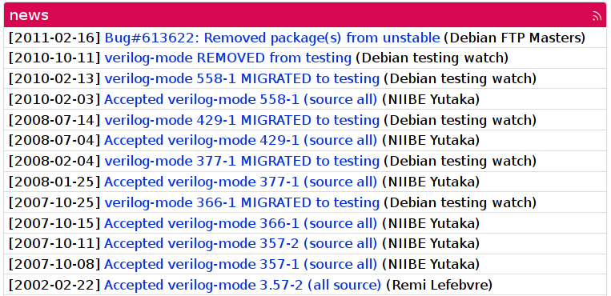
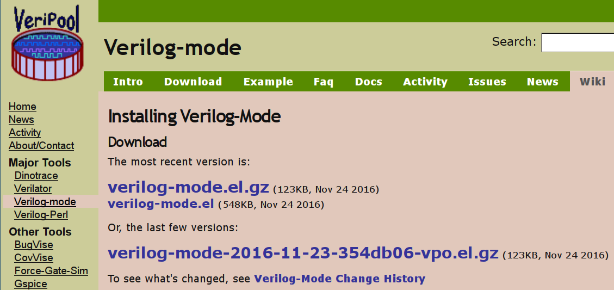
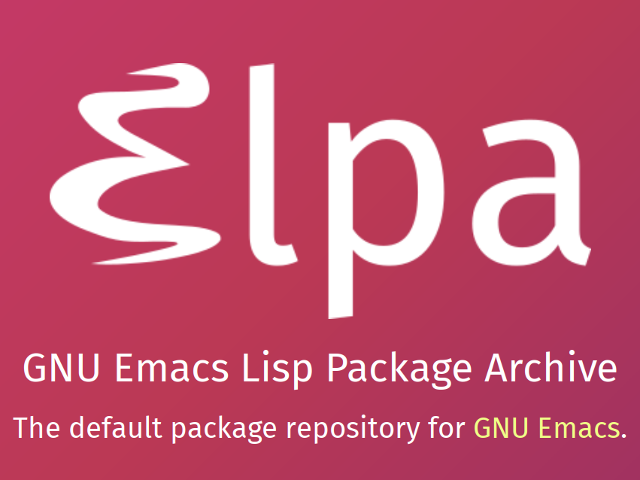
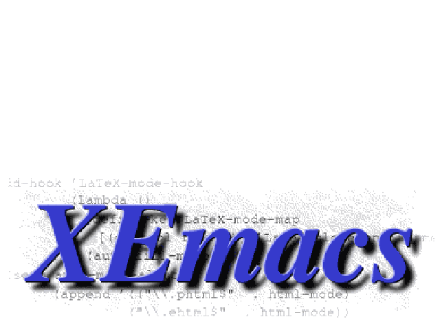

# Emacs verilog-mode is coming to Debian, again


Kiwamu Okabe

# Do you know IceStorm?


* First, please watch following video:
* http://youtu.be/rdLgLCIDSk0
* It's a Forth machine on Lattice FPGA.
* And it's designed by an Open Source tool.
* The tool is called "IceStorm"!
* http://www.clifford.at/icestorm/

# Coming OSS wave to FPGA world


* Xilinx and Altera only support proprietary tool for own FPGA.
* IceStorm is an Open Source tool for Lattice FPGA.
* Please remember GCC that changed everything in software world.
* I hope IceStorm change FPGA world with the Open Source wave!

# Flow to design C application


* GNU Project created everything:

```
* Editor (Emacs)
* Compiler (gcc)
* Assembler and Linker (binutils)
```

* Everything is debianized.



# Flow to design FPGA application


* Following tools is created by IceStorm Project:

```
yosys, arachne-pnr, icepack, iceprog
```

* But Emacs verilog-mode is not yet debianized.



# In the past, there is it...


* https://tracker.debian.org/pkg/verilog-mode



# Let's debianize verilog-mode, again!


```
Subject: ITP: verilog-mode -- emacs mode for Verilog code
Package: wnpp
Severity: wishlist
Owner: Kiwamu Okabe <kiwamu@debian.or.jp>

* Package name: verilog-mode
  Version: 20160910.debfc6d.vpo
  Upstream Author: Michael McNamara <mac@verilog.com>, Wilson Snyder
<wsnyder@wsnyder.org>
* URL: https://github.com/veripool/verilog-mode
  Vcs-Browser: https://anonscm.debian.org/cgit/collab-maint/verilog-mode.git
* License: GPL3
  Programming Lang: Emacs-lisp
  Description: emacs mode for Verilog code
 This package provides an emacs major mode for editing
 files in the Verilog code. It features syntax
 highlighting and auto-indentation.
```

# Where is the verilog-mode?


* http://www.veripool.org/projects/verilog-mode/wiki/Installing
* But it only publishes single el file...



# Where is full source code?


* https://github.com/veripool/verilog-mode
* It has own test code for verilog-mode.el
* and also info file.

# Use git-buildpackage


* The "upstream" branch tracks upsteam repo.
* The "master" branch keeps Debian own changing.
* Set release tag at on "upstream" branch.

```bash
$ git tag
upstream/20160910.debfc6d
upstream/20160910.debfc6d.vpo # <== miss tag
upstream/20161124.fd230e6
```

# Create debian/rules


```makefile
#!/usr/bin/make -f

include /usr/share/cdbs/1/rules/debhelper.mk

build:
        make test

clean::
        make clean
        rm -f ChangeLog.txt emacs-version.h
```

# Create debian/control


```
Priority: optional
Maintainer: Debian Emacs addons team <pkg-emacsen-addons@lists.alioth.debian.org>
Uploaders: Kiwamu Okabe <kiwamu@debian.or.jp>
Build-Depends: debhelper (>= 10), cdbs, emacs25, xemacs21, texinfo, time
Standards-Version: 3.9.8
Vcs-Git: https://anonscm.debian.org/git/pkg-emacsen/pkg/verilog-mode.git
Vcs-Browser: https://anonscm.debian.org/cgit/pkg-emacsen/pkg/verilog-mode.git/
Homepage: http://www.veripool.org/wiki/verilog-mode

Package: verilog-mode
Architecture: all
Depends: ${misc:Depends}, emacsen-common (>= 2.0.8), emacs | emacsen
Description: emacs mode for Verilog code
 This package provides an emacs major mode for editing
 files in the Verilog code. It features syntax
 highlighting and auto-indentation.
```

# Create special files for Elisp package


```
$ ls verilog-mode/debian/verilog-mode.emacsen-*
verilog-mode/debian/verilog-mode.emacsen-compat
verilog-mode/debian/verilog-mode.emacsen-install
verilog-mode/debian/verilog-mode.emacsen-remove
verilog-mode/debian/verilog-mode.emacsen-startup
```

It's copied and pasted from the other package.

# Reviewed by Sean Whitton


* https://spwhitton.name/
* https://wiki.debian.org/SeanWhitton
* He is not a Debian Developer.
* But he carefully reviewed my package.
* Thanks, Sean!

```
https://bugs.debian.org/cgi-bin/bugreport.cgi?bug=840424
```

# Review: join pkg-emacsen alioth group


* http://pkg-emacsen.alioth.debian.org/
* They focus to maintain elisp using ELPA.
* About ELPA will be described later.
* They are using git repo in /git/pkg-emacsen/pkg
* and not in /git/collab-maint.

# Review: use secure URIs for Vcs-* fields


* He said following is correct:

```
Vcs-Git: https://anonscm.debian.org/git/pkg-emacsen/pkg/verilog-mode.git
Vcs-Browser: https://anonscm.debian.org/cgit/pkg-emacsen/pkg/verilog-mode.git
```

* and following is incorrect:

```
Vcs-Git: git://anonscm.debian.org/pkg-emacsen/pkg/verilog-mode.git <= Bad!
Vcs-Browser: https://anonscm.debian.org/git/pkg-emacsen/pkg/verilog-mode.git
```

# Review: should include info file


* Original texinfo has "info-document-missing-dir-section" lintian error that is fixed by upstream side.

```
https://github.com/veripool/verilog-mode/pull/13
```

* Cut information that are confusing Debian users

```
$ cat verilog-mode/debian/patches/texinfo-for-Debian.patch
--snip--
 @menu
-* New Versions::               Getting new versions
-* Installing::                 How to install the Verilog Mode
 * Getting Started::            Getting started using the Verilog-mode
 * Colors::                     Enabling and customizing the colors
 * FAQ::                                Frequently Asked Questions
 @end menu
--snip--
```

# Review: should have DEP-3 header


* Patch Tagging Guidelines

```
http://dep.debian.net/deps/dep3/
```

* "cme" tool is very useful to modify the header and verify it.

```
https://ddumont.wordpress.com/2014/06/15/edit-your-debian-patch-header-for-dep-3-compliance-with-cme/
```

# Review: how about using dh-elpa


* ELPA (Emacs Lisp Package Archive)
* http://elpa.gnu.org/
* It's the default package repository for Emacs.
* But it only supported by Emacs
* and XEmacs has no feature such like ELPA.
* Debian pkg-emacsen team are converting all existing Emacs Lisp addon packages using dh-elpa.

# dh-elpa is easy to use


```
$ apt-get source elpa-vala-mode
$ cat elpa-rust-mode-0.3.0/debian/rules
```

```makefile
#!/usr/bin/make -f

%:
        dh "$@" --parallel --with elpa

override_dh_auto_clean:
        rm -f rust-mode.elc

override_dh_auto_test:
        ./run_rust_emacs_tests.sh
```

# Verilog-mode test fails on XEmacs


```
On Sat, Oct 15, 2016 at 7:44 PM, Wilson Snyder <wsnyder@wsnyder.org> wrote:
>>>On Sat, Oct 15, 2016 at 3:48 PM, Kiwamu Okabe <kiwamu@debian.or.jp> wrote:
>>>> I found that! If we run "make test" on fakeroot environment, we get
>>>> such error!
>>>
>>> I would like to fix this problem on Debian side by running "make test"
>>> on normal user.
>
> Makes sense.  I suspect the eval is turned off as
> root/fakeroot for security, however this verilog-mode test
> depends on that eval feature, so obviously the test will
> fail.
```

# Who is using XEmacs?


* ftp://ftp.xemacs.org/ is shutdown?

```
$ zcat /usr/share/doc/xemacs21/changelog.Debian.gz
--snip--
xemacs21 (21.4.24-1) unstable; urgency=low

  * New upstream release.
--snip--
 -- Mark Brown <broonie@debian.org>  Thu, 13 Aug 2015 13:14:35 +0100
```

# We should drop emacsen!


* Mule was dead.
* XEmacs will be dead.
* Emacs has a big community, today.
* Should we focus Emacs without XEmacs?

# Conclusion


* Verilog-mode for Emacs is coming to Debian, soon.
* IceStorm is rewriting game rule as OSS style on FPGA.
* Use IceStorm. No more Vivado and Quartus!

# PR: Join SELTECH CORPORATION!


* http://seltech.co.jp/en/
* Developing a Hypervisor for embedded system
* We are hiring embedded software engineer!


# License of photos


```
* Creative Commons BBB | Flickr
  https://www.flickr.com/photos/steren/2732488224/
  Copyright: Steren Giannini / License: CC BY 2.0
* TACC Visualization: Blood Flow in the Aorta | electric8sheep | Flickr
  https://www.flickr.com/photos/28285401@N05/4318538779/
  Copyright: electric8sheep / License: CC BY 2.0
* Corey Donohoe (GitHub): Metrics Driven | Flickr - Photo Sharing!
  https://www.flickr.com/photos/stevelacey/5820920545/
  Copyright: Steve Lacey / License: CC BY 2.0
* Single plant | Sarah | Flickr
  https://www.flickr.com/photos/dm-set/22008748572/
  Copyright: Sarah / License: CC BY 2.0
```
