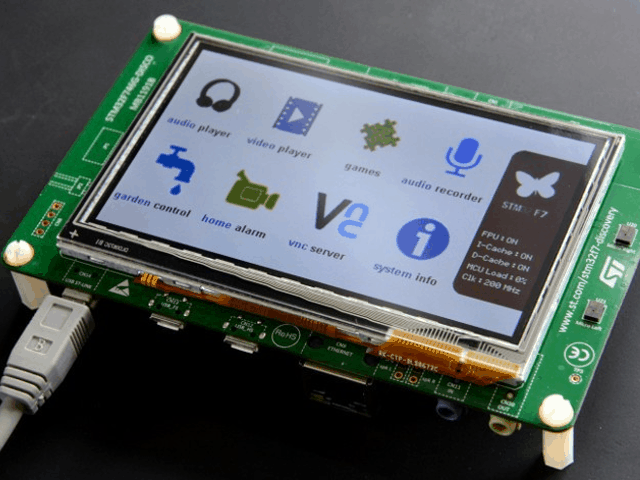
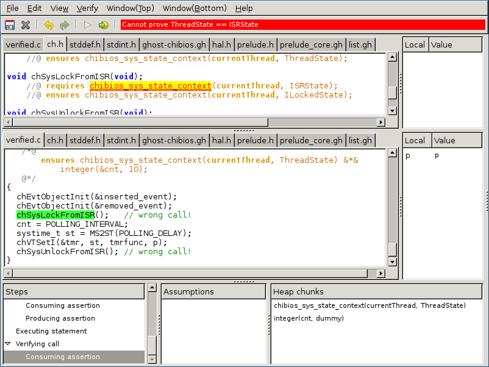

# Comparing ATS and VeriFast on RTOS system state


Kiwamu Okabe @ RIKEN AICS

# Real-time OS: ChibiOS/RT


* http://www.chibios.org/
* Simple/Small/Fast/Portable real-time OS
* Context Switch (STM32F4xx): 0.40 µsec
* Kernel Size (STM32F4xx): 6172 byte
* Run on ARM Cortex-M, Arduino Uno, PowerPC e200

# System state in ChibiOS/RT


# Class of system API in ChibiOS/RT


* "Normal" must be called on Thread
* "S-Class" must be called on S-Locked
* "I-Class" must be called on I-Locked or S-Locked
* "X-Class" must be called on Thread, S-Locked or I-Locked
* "Special" have special execution requirements
* "Object Initializers" can be used in any state

# Example: chSysLock()


* Enters the kernel lock mode
* Special function
* Should be called on Thread state
* Change system state into S-Locked state

# Example: chVTSetI()


* Enables a virtual timer
* I-Class function
* Should be called on I-Locked or S-Locked state
* Doesn't change system state

# Using system API in C


An function to initialize Virtual Timer.

```c
static void tmr_init(void *p) {
  chEvtObjectInit(&inserted_event);
  chEvtObjectInit(&removed_event);
  chSysLock();
  cnt = POLLING_INTERVAL;
  chVTSetI(&tmr, MS2ST(POLLING_DELAY), tmrfunc, p);
  chSysUnlock();
}
```

# Undefined behavior by wrong calling!


You will see undefined behavior, if you call "chSysLockFromISR()" function on Thread state.

```c
static void tmr_init(void *p) {
  chEvtObjectInit(&inserted_event);
  chEvtObjectInit(&removed_event);
  chSysLockFromISR();   // wrong call!
  cnt = POLLING_INTERVAL;
  chVTSetI(&tmr, MS2ST(POLLING_DELAY), tmrfunc, p);
  chSysUnlockFromISR(); // wrong call!
}
```

# Want to avoid it at compile-time...


* The system state is a state machine.
* Can't we find it at compile-time?

# ATS language can do that!


* http://www.ats-lang.org/
* Syntax is similar to ML
* DML-style dependent types / Linear types
* Theorem proving / Safely use pointer
* Without GC / Without runtime
* Compiled into C language code

# ATS programing on ChibiOS/RT


* https://github.com/fpiot/chibios-ats-2
* ATS code is found at following:
* https://github.com/fpiot/chibios-ats-2/blob/master/demos/STM32/RT-STM32F746G-DISCOVERY-LWIP-FATFS-USB/main.dats

# Define linear type for system state


Linear type "chss" depends on static int which represents ID of system state.

```ats
#define chss_init       0
#define chss_thread     1
#define chss_irqsusp    2
#define chss_irqdisable 3
#define chss_irqwait    4
#define chss_isr        5
#define chss_slock      6
#define chss_ilock      7
absvtype chss(s:int)
vtypedef chss_any = [s:int | chss_init <= s; s <= chss_ilock] chss(s)
vtypedef chss_iclass = [s:int | s == chss_slock || s == chss_ilock] chss(s)
```

# Import system API from C


```ats
extern fun chSysLock (!chss(chss_thread) >> chss(chss_slock) | ): void
  = "mac#"
extern fun chSysUnlock (!chss(chss_slock) >> chss(chss_thread) | ): void
  = "mac#"
extern fun chSysLockFromISR (!chss(chss_isr) >> chss(chss_ilock) | ): void
  = "mac#"
extern fun chSysUnlockFromISR (!chss(chss_ilock) >> chss(chss_isr) | ): void
  = "mac#"
extern fun chEvtBroadcastI (!chss_iclass | cPtr0(event_source_t)): void
  = "mac#"
extern fun chEvtObjectInit (!chss_any | cPtr0(event_source_t)): void = "mac#"
extern fun chVTSetI (!chss_iclass | cPtr0(virtual_timer_t), systime_t,
  vtfunc_t, cPtr0(BaseBlockDevice)): void = "mac#"
```

# Using system API in ATS


Every function takes linear type as 1st argument.

```ats
extern fun tmr_init (!chss(chss_thread) | ptr): void = "mac#"
implement tmr_init (pss | p) = {
  val bbdp = $UN.cast{cPtr0(BaseBlockDevice)}(p)

  val () = chEvtObjectInit (pss | inserted_event_p)
  val () = chEvtObjectInit (pss | removed_event_p)
  val () = chSysLock (pss | )
  extvar "cnt" = POLLING_INTERVAL
  val () = chVTSetI (pss | tmr_p, MS2ST (POLLING_DELAY), tmrfunc, bbdp)
  val () = chSysUnlock (pss | )
}
```

# If you call wrong system API...


```ats
extern fun tmr_init (!chss(chss_thread) | ptr): void = "mac#"
implement tmr_init (pss | p) = {
  val bbdp = $UN.cast{cPtr0(BaseBlockDevice)}(p)

  val () = chEvtObjectInit (pss | inserted_event_p)
  val () = chEvtObjectInit (pss | removed_event_p)
  val () = chSysLockFromISR (pss | )   // wrong call!
  extvar "cnt" = POLLING_INTERVAL
  val () = chVTSetI (pss | tmr_p, MS2ST (POLLING_DELAY), tmrfunc, bbdp)
  val () = chSysUnlockFromISR (pss | ) // wrong call!
}
```

# ATS finds the error at compile-time!


```
$ patsopt -o build/obj/main.c -d main.dats
/home/kiwamu/src/chibios-ats-2/demos/STM32/RT-STM32F746G-DISCOVERY-LWIP-FATFS-USB/main.dats: 4617(line=134, offs=30) -- 4620(line=134, offs=33): error(3): unsolved constraint: C3NSTRprop(C3TKmai
n(); S2Eeqeq(S2Eintinf(1); S2Eintinf(5)))
```

* It means that ATS compiler can't solve "1 == 5",
* while checking Thread state "chss(chss_thread)" equals ISR state "chss(chss_isr)".
* Because "chss_thread" is 1 and "chss_isr" is 5.

# Also, VeriFast can do that!


* https://github.com/verifast/verifast
* A verifier for single-threaded and multithreaded C language programs annotated with preconditions and postconditions written in separation logic.
* VeriFast is easy to use with the graphical IDE.

# Verified C code on ChibiOS/RT


* https://github.com/fpiot/chibios-verifast
* Verified code if found at following:
* https://github.com/fpiot/chibios-verifast/blob/master/verifast_demo/STM32/RT-STM32F746G-DISCOVERY-LWIP-FATFS-USB/verified/verified.c

# Define inductive datatype for state


The predicate is produced/consumed as assertion.

```
inductive SystemState =
  | InitState
  | HALInitedState
  | ThreadState
  | IRQSuspendedState
  | IRQDisabledState
  | IRQWaitState
  | ISRState
  | SLockedState
  | ILockedState
  ;
predicate chibios_sys_state_context(int threadId; SystemState state);
```

# Define fixpoint function for API Class


Shape Anything class and I-Class.

```
fixpoint bool chibios_sys_state_any(SystemState state) { return true; }
fixpoint bool chibios_sys_state_iclass(SystemState state) {
  switch(state) {
    case InitState: return false;
    case HALInitedState: return false;
    case ThreadState: return false;
    case IRQSuspendedState: return false;
    case IRQDisabledState: return false;
    case IRQWaitState: return false;
    case ISRState: return false;
    case SLockedState: return true;
    case ILockedState: return true;
  }
}
```

# Apply pre/postcondition to C API #1


```c
void chEvtObjectInit(event_source_t *esp);
    //@ requires chibios_sys_state_context(currentThread, ?state) &*& chibios_sys_state_any(state) == true;
    //@ ensures chibios_sys_state_context(currentThread, state);
void chVTSetI(virtual_timer_t *vtp, systime_t delay, vtfunc_t vtfunc, void *par);
    //@ requires chibios_sys_state_context(currentThread, ?state) &*& chibios_sys_state_iclass(state) == true;
    //@ ensures chibios_sys_state_context(currentThread, state);
void chSysLock(void);
    //@ requires chibios_sys_state_context(currentThread, ThreadState);
    //@ ensures chibios_sys_state_context(currentThread, SLockedState);
// continue...
```

# Apply pre/postcondition to C API #2


```c
void chSysUnlock(void);
    //@ requires chibios_sys_state_context(currentThread, SLockedState);
    //@ ensures chibios_sys_state_context(currentThread, ThreadState);
void chSysLockFromISR(void);
    //@ requires chibios_sys_state_context(currentThread, ISRState);
    //@ ensures chibios_sys_state_context(currentThread, ILockedState);
void chSysUnlockFromISR(void);
    //@ requires chibios_sys_state_context(currentThread, ILockedState);
    //@ ensures chibios_sys_state_context(currentThread, ISRState);
```

# Using system API in verified C #1


Add pre/postcondition into function.

```c
void tmr_init(void *p)
   /*@
       requires chibios_sys_state_context(currentThread, ThreadState) &*&
           integer(&cnt, _);
   @*/
   /*@
       ensures chibios_sys_state_context(currentThread, ThreadState) &*&
           integer(&cnt, 10);
   @*/
{
// continue...
```

# Using system API in verified C #2


```c
  chEvtObjectInit(&inserted_event);
  chEvtObjectInit(&removed_event);
  chSysLock();
  cnt = POLLING_INTERVAL;
  systime_t st = MS2ST(POLLING_DELAY);
  chVTSetI(&tmr, st, tmrfunc, p);
  chSysUnlock();
}
```

# If you call wrong system API...


```c
void tmr_init(void *p)
   /*@
       requires chibios_sys_state_context(currentThread, ThreadState) &*&
           integer(&cnt, _);
   @*/
// --snip--
{
  chEvtObjectInit(&inserted_event);
  chEvtObjectInit(&removed_event);
  chSysLockFromISR();   // wrong call!
  cnt = POLLING_INTERVAL;
  systime_t st = MS2ST(POLLING_DELAY);
  chVTSetI(&tmr, st, tmrfunc, p);
  chSysUnlockFromISR(); // wrong call!
}
```

# VeriFast finds the error on verification!




# Conclusion


* Some RTOS has own system state.
* You see undefined behavior, if you violate it.
* ATS compiler finds such error at compile-time.
* VeriFast verifier finds such error on verification.
* ATS code can use more rich type than C, but embedded programmer is not familiar with it.
* VeriFast IDE verifies C code, and is easy to learn.
