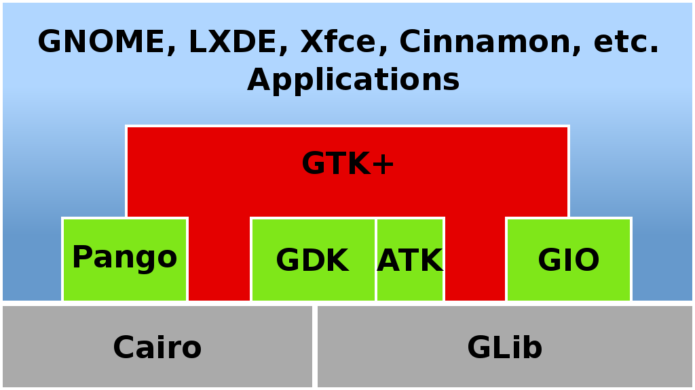
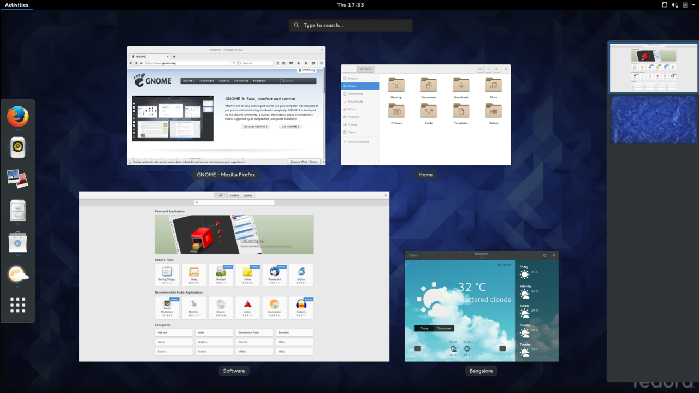
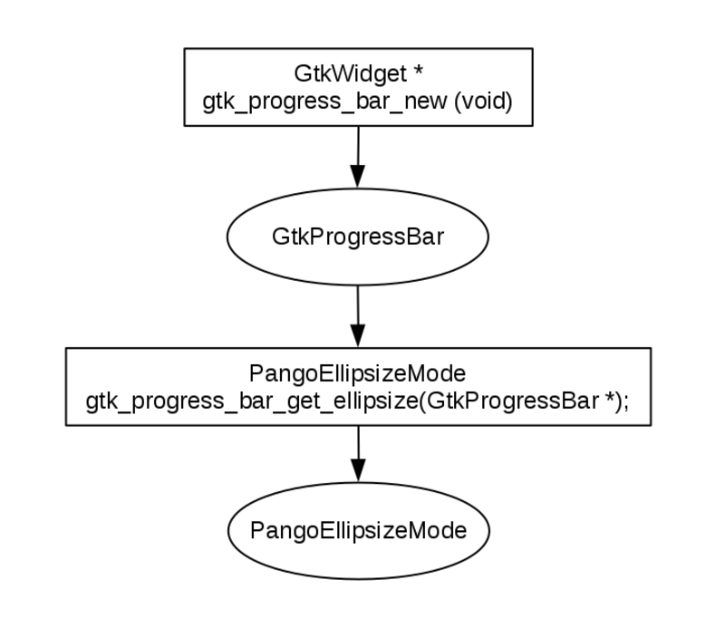
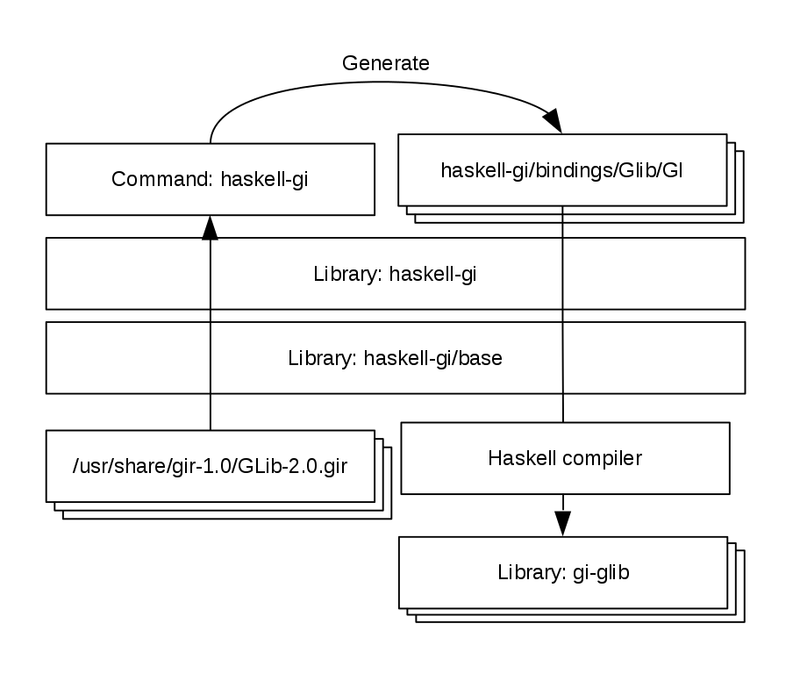

# Introduction of GObject Introspection

Kiwamu Okabe

# What's GTK+?

https://www.gtk.org/

* A cross-platform widget toolkit for creating GUI
* Written in C language



# Application example: GIMP

https://www.gimp.org/


# Application example: GNOME

https://www.gnome.org/



# What's GLib?

https://wiki.gnome.org/Projects/GLib

* A part of GTK+
* A low-level system library to provide advanced data structures and threads
* Written in C language

# Note: optimistically using malloc(3)

* Application causes error, if malloc returns NULL
* GLib is not suitable for application without MMU

```c
gpointer g_malloc (gsize n_bytes) {
  if (G_LIKELY (n_bytes)) {
      gpointer mem;

      mem = malloc (n_bytes);
      if (mem) return mem;
      g_error ("%s: failed to allocate %"G_GSIZE_FORMAT" bytes",
               G_STRLOC, n_bytes);
  }
  return NULL;
}
```

# What's GObject?

https://developer.gnome.org/gobject/stable/

* A part of GLib
* An object system includes type system GType
* Written in C language

# Implementation of GObject

xxx UML?

# Example class: GtkProgressBar

https://developer.gnome.org/gtk3/stable/GtkProgressBar.html

```
GObject
=> GInitiallyUnowned
   => GtkWidget
      => GtkProgressBar
```


# Example functions: GtkProgressBar



# Example definition: GtkProgressBar

xxx gtk/gtkprogressbar.hをUML図に

# Example constructor: GtkProgressBar

```
GtkWidget *gtk_progress_bar_new()
=> g_object_new((GType) GTK_TYPE_PROGRESS_BAR, NULL)
   => g_object_new_with_properties((GType) GTK_TYPE_PROGRESS_BAR, 0,
                                   NULL, NULL)
      => GObjectClass *class =
	       g_type_class_peek_static((GType) GTK_TYPE_PROGRESS_BAR)
         => TypeNode *node = lookup_type_node_I(type)
         => return node->data->class.class
      => return (GObject *) g_object_new_internal(class, NULL, 0)
         => return (GObject *) g_type_create_instance(
		                         class->g_type_class.g_type)
```

# Manually writing language bindings

* Human easily inject mistake on manually writing
* It's a big problem...

# GObject Introspection (GI) is an answer!

* A middleware layer between C libraries (using GObject) and language bindings
* Such languages are:

```
JavaScript
Python
Perl
Java
Lua
.NET
Scheme
etc.
```

# How many APIs are supported by GI?

Debian provides APIs of the 285 application!

```
$ lsb_release -a |& grep Description:
Description:    Debian GNU/Linux 9.0 (stretch)
$ apt-file search /usr/share/gir-1.0/ | wc -l
285
$ apt-file search /usr/share/gir-1.0/ | head -8
budgie-core-dev: /usr/share/gir-1.0/Budgie-1.0.gir
diodon-dev: /usr/share/gir-1.0/Diodon-1.0.gir
gir1.2-atril: /usr/share/gir-1.0/AtrilDocument-1.5.0.gir
gir1.2-atril: /usr/share/gir-1.0/AtrilView-1.5.0.gir
gir1.2-caja: /usr/share/gir-1.0/Caja-2.0.gir
gir1.2-entangle-0.1: /usr/share/gir-1.0/Entangle-0.1.gir
gir1.2-eom: /usr/share/gir-1.0/Eom-1.0.gir
gir1.2-fcitx-1.0: /usr/share/gir-1.0/Fcitx-1.0.gir
```

# What's haskell-gi?

https://github.com/haskell-gi/haskell-gi

* An implementation of GI for Haskell language
* Generate Haskell bindings for GObject Introspection capable libraries
* Supports: GLib, cairo, Pango, Gdk, Gio, GObject, GdkPixbuf, Atk, Gtk, GtkSource and WebKit

# How to install haskell-gi? #1

```
$ git clone https://github.com/haskell-gi/haskell-gi.git
$ sudo apt install aeson-pretty libghc-aeson-pretty-dev
$ (cd haskell-gi/base && cabal install --force-reinstalls)
$ (cd haskell-gi && cabal install --force-reinstalls)
$ which haskell-gi
/home/User/.cabal/bin/haskell-gi
$ (cd haskell-gi/bindings && cabal run genBuildInfo `./PKGS.sh`)
        ...generating...
        bindings/GLib/LICENSE
        bindings/GLib/README.md
        bindings/GLib/Setup.hs
        bindings/GLib/gi-glib.cabal
        bindings/GLib/stack.yaml
        ...generating...
```

# How to install haskell-gi? #2

```
$ (cd haskell-gi/bindings && cabal install ./GLib ./cairo ./Pango ./Gdk ./Gio ./GObject ./GdkPixbuf ./Atk --force-reinstalls)
        ...generating...
2        bindings/GLib/GI/
        ...generating...
$ (cd haskell-gi/bindings && cabal install ./Gtk --force-reinstalls)
$ (cd haskell-gi/test && bash runtest.sh)
```


# What happen with the installation?



# What hint does GI use to generate? #1

```
$ vi /usr/share/gir-1.0/Gtk-3.0.gir
```

```xml
...
    <class name="ProgressBar"
           c:symbol-prefix="progress_bar"
           c:type="GtkProgressBar"
           parent="Widget"
           glib:type-name="GtkProgressBar"
           glib:get-type="gtk_progress_bar_get_type"
           glib:type-struct="ProgressBarClass">
      <constructor name="new" c:identifier="gtk_progress_bar_new">
        <doc xml:space="preserve">Creates a new #GtkProgressBar.</doc>
        <return-value transfer-ownership="none">
          <doc xml:space="preserve">a #GtkProgressBar.</doc>
          <type name="Widget" c:type="GtkWidget*"/>
        </return-value>
      </constructor>
```

# What hint does GI use to generate? #2

```xml
      <method name="get_ellipsize"
              c:identifier="gtk_progress_bar_get_ellipsize"
              version="2.6">
        ...
        <return-value transfer-ownership="none">
          <doc xml:space="preserve">#PangoEllipsizeMode</doc>
          <type name="Pango.EllipsizeMode" c:type="PangoEllipsizeMode"/>
        </return-value>
        <parameters>
          <instance-parameter name="pbar" transfer-ownership="none">
            <doc xml:space="preserve">a #GtkProgressBar</doc>
            <type name="ProgressBar" c:type="GtkProgressBar*"/>
          </instance-parameter>
        </parameters>
      </method>
...
```

# What code is generated by GI? #1


# What code is generated by GI? #2

```
$ vi haskell-gi/bindings/Gtk/GI/Gtk/Objects/ProgressBar.hs
```

```haskell
...
newtype ProgressBar = ProgressBar (ManagedPtr ProgressBar)
foreign import ccall "gtk_progress_bar_get_type"
    c_gtk_progress_bar_get_type :: IO GType
instance GObject ProgressBar where
    gobjectType _ = c_gtk_progress_bar_get_type
foreign import ccall "gtk_progress_bar_new" gtk_progress_bar_new ::
    IO (Ptr ProgressBar)
progressBarNew ::
    (B.CallStack.HasCallStack, MonadIO m) =>
    m ProgressBar
progressBarNew  = liftIO $ do
    result <- gtk_progress_bar_new
```

# What code is generated by GI? #3

```haskell
    checkUnexpectedReturnNULL "progressBarNew" result
    result' <- (newObject ProgressBar) result
    return result'
foreign import ccall "gtk_progress_bar_get_ellipsize" gtk_progress_bar_get_ellipsize :: 
    Ptr ProgressBar -> IO CUInt
progressBarGetEllipsize ::
    (B.CallStack.HasCallStack, MonadIO m, IsProgressBar a) =>
    a -> m Pango.Enums.EllipsizeMode
progressBarGetEllipsize pbar = liftIO $ do
    pbar' <- unsafeManagedPtrCastPtr pbar
    result <- gtk_progress_bar_get_ellipsize pbar'
    let result' = (toEnum . fromIntegral) result
    touchManagedPtr pbar
    return result'
...
```

# What's ManagedPtr? #1

```
$ vi haskell-gi/base/Data/GI/Base/BasicTypes.hs
```

```haskell
...
data ManagedPtr a = ManagedPtr {
      managedForeignPtr :: ForeignPtr a
    , managedPtrIsOwned :: IORef Bool
    }
type ManagedPtrNewtype a = Coercible a (ManagedPtr ())
class ManagedPtrNewtype a => BoxedObject a where
    boxedType :: a -> IO GType
class ManagedPtrNewtype a => GObject a where
    gobjectType :: a -> IO GType
...
```

# What's ManagedPtr? #2

```
$ vi haskell-gi/base/Data/GI/Base/ManagedPtr.hs
```

```haskell
...
newManagedPtr :: Ptr a -> IO () -> IO (ManagedPtr a)
newManagedPtr ptr finalizer = do
  let ownedFinalizer :: IORef Bool -> IO ()
      ownedFinalizer boolRef = do
        owned <- readIORef boolRef
        when owned finalizer
  isOwnedRef <- newIORef True
  fPtr <- FC.newForeignPtr ptr (ownedFinalizer isOwnedRef)
  return $ ManagedPtr {
               managedForeignPtr = fPtr
             , managedPtrIsOwned = isOwnedRef
             }
...
```

# What's ManagedPtr? #3

```haskell
...
touchManagedPtr :: forall a. ManagedPtrNewtype a => a -> IO ()
touchManagedPtr m = let c = coerce m :: ManagedPtr ()
                    in (touchForeignPtr . managedForeignPtr) c
...
-- This function ensures that the foreign object in question is alive at the given place in the sequence of IO actions. In particular withForeignPtr does a touchForeignPtr after it executes the user action.
touchForeignPtr :: ForeignPtr a -> IO ()
```

# What's ManagedPtr? #4

```haskell
...
disownManagedPtr :: forall a. (HasCallStack, ManagedPtrNewtype a) => a -> IO (Ptr a)
disownManagedPtr managed = do
  ptr <- unsafeManagedPtrGetPtr managed
  writeIORef (managedPtrIsOwned c) False
  return ptr
    where c = coerce managed :: ManagedPtr ()
...
```

# How is GObject implemented in GI? #1

```
$ vi haskell-gi/base/Data/GI/Base/ManagedPtr.hs
```

```haskell
foreign import ccall "dynamic"
   mkFinalizer :: FinalizerPtr a -> Ptr a -> IO ()
newManagedPtr' :: FinalizerPtr a -> Ptr a -> IO (ManagedPtr a)
newManagedPtr' finalizer ptr = newManagedPtr ptr (mkFinalizer finalizer ptr)

foreign import ccall "&dbg_g_object_unref"
    ptr_to_g_object_unref :: FunPtr (Ptr a -> IO ())
foreign import ccall "g_object_ref_sink" g_object_ref_sink ::
    Ptr a -> IO (Ptr a)
newObject :: (GObject a, GObject b) => (ManagedPtr a -> a) -> Ptr b -> IO a
newObject constructor ptr = do
  void $ g_object_ref_sink ptr
  fPtr <- newManagedPtr' ptr_to_g_object_unref $ castPtr ptr
  return $! constructor fPtr
```

# How is GObject implemented in GI? #2

```haskell
withManagedPtr :: (HasCallStack, ManagedPtrNewtype a) => a -> (Ptr a -> IO c) -> IO c
withManagedPtr managed action = do
  ptr <- unsafeManagedPtrGetPtr managed
  result <- action ptr
  touchManagedPtr managed
  return result
disownManagedPtr :: forall a. (HasCallStack, ManagedPtrNewtype a) => a -> IO (Ptr a)
disownManagedPtr managed = do
  ptr <- unsafeManagedPtrGetPtr managed
  writeIORef (managedPtrIsOwned c) False
  return ptr
    where c = coerce managed :: ManagedPtr ()
```

# How is GObject implemented in GI? #3

```haskell
foreign import ccall "dbg_g_object_disown"
        dbg_g_object_disown :: Ptr a -> IO ()
disownObject :: GObject a => a -> IO (Ptr b)
disownObject obj = withManagedPtr obj $ \ptr -> do
                     dbg_g_object_disown ptr
                     castPtr <$> disownManagedPtr obj
```

# Let's create ATS GI framework!

To be continued...
