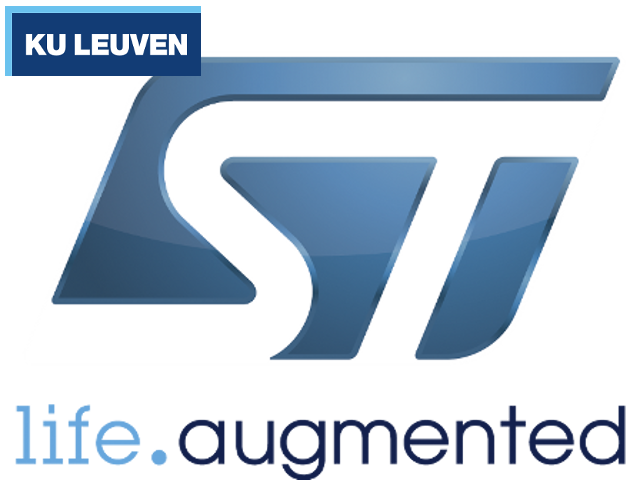
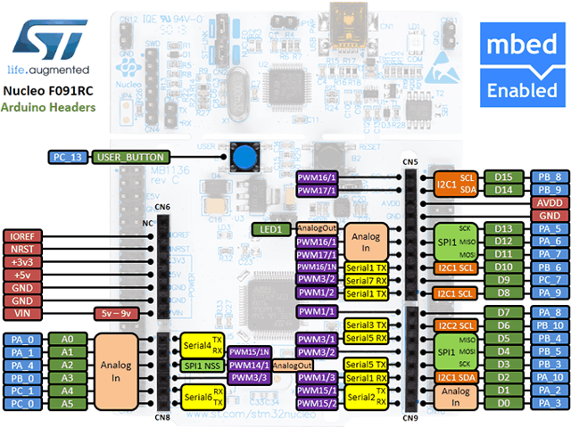
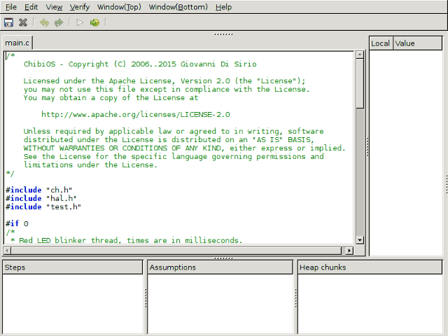
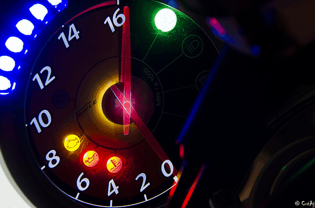
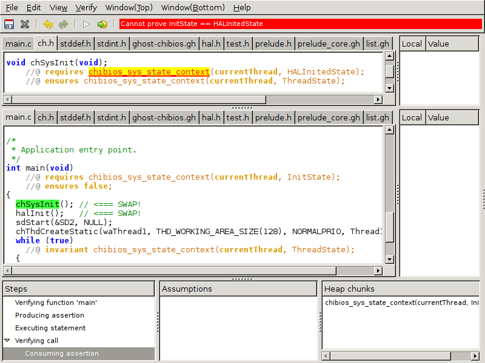

# Hands-on VeriFast with STM32 microcontroller @ Nagoya



Kiwamu Okabe

# Table of Contents


* Introduce ChibiOS/RT which is a RTOS
* Get development environment for ChibiOS/RT
* Build sample application on ChibiOS/RT
* Introduce STM32 microcontroller
* Run the application on STM32 board
* Introduce VeriFast
* Verify the application using VeriFast

# What's ChibiOS/RT?


* http://www.chibios.org/
* Simple / Small / Fast / Portable real-time OS
* Run on ARM Cortex-M / 8-bit AVR / PowerPC e200
* Context Switch (STM32F4xx): 0.40 µsec
* Kernel Size (STM32F4xx): 6172 byte

# Overview of the devel-environment


# Get the devel-environment #Windows


```
Detail: https://github.com/fpiot/chibios-verifast/blob/master/doc/README.Windows.en.md
```

* Install following:

```
* https://git-for-windows.github.io/
* https://launchpad.net/gcc-arm-embedded/+download
* https://ttssh2.osdn.jp/index.html.en
* https://cygwin.com/
```

* Install following cygwin packages

```
* cmake
* libusb1.0-devel
```

# Get the devel-environment #Windows


* Open cygwin terminal, and install "stlink":

```
$ git clone https://github.com/texane/stlink.git
$ (cd stlink && make)
$ (cd stlink/build/Release && make install)
```

* Download VeriFast from following URL, unzip it and set PATH to "verifast-XXXXXXX/bin" directory.

```
https://github.com/verifast/verifast#binaries
```

# Get the devel-environment #Windows


* Open cygwin terminal, and checkout custom ChibiOS/RT source code:

```
$ git clone https://github.com/fpiot/chibios-verifast.git
```

# Get the devel-environment #macOS


```
Detail: https://github.com/fpiot/chibios-verifast/blob/master/doc/README.MacOS.en.md
```

* Install brew packages:

```
$ brew tap PX4/homebrew-px4
$ brew update
$ brew install wget git gcc-arm-none-eabi cmake picocom libusb
```

* Install "stlink":

```
$ git clone https://github.com/texane/stlink.git
$ (cd stlink && make)
$ (cd stlink/build/Release && sudo make install)
```

# Get the devel-environment #macOS


* Download VeriFast, unzip it and set PATH:

```
$ wget http://82076e0e62875f063ae8-929808a701855dfb71539d0a4342d4be.r54.cf5.rackcdn.com/verifast-nightly-osx.tar.gz
$ tar xf verifast-nightly-osx.tar.gz
$ mv verifast-*/ verifast
$ export PATH=`pwd`/verifast/bin:$PATH
```

* Checkout custom ChibiOS/RT source code:

```
$ git clone https://github.com/fpiot/chibios-verifast.git
```

# Get the devel-environment #Linux


```
Detail: https://github.com/fpiot/chibios-verifast/blob/master/doc/README.Linux.en.md
```

* Install deb packages:

```
$ sudo apt-get install wget git libgtk2.0-0 libgtksourceview2.0-0 libusb-1.0-0-dev libgtk-3-dev build-essential cmake gcc-arm-none-eabi gdb-arm-none-eabi picocom
```

* Install "stlink":

```
$ git clone https://github.com/texane/stlink.git
$ (cd stlink && make)
$ (cd stlink/build/Release && sudo make install)
$ sudo ldconfig
```

# Get the devel-environment #Linux


* Download VeriFast, unzip it and set PATH:

```
$ wget http://82076e0e62875f063ae8-929808a701855dfb71539d0a4342d4be.r54.cf5.rackcdn.com/verifast-nightly.tar.gz
$ tar xf verifast-nightly.tar.gz
$ mv verifast-*/ verifast
$ export PATH=`pwd`/verifast/bin:$PATH
```

* Checkout custom ChibiOS/RT source code:

```
$ git clone https://github.com/fpiot/chibios-verifast.git
```

# Build a ChibiOS application


* Finally build the code:

```
$ cd chibios-verifast/verifast_demo/STM32/RT-STM32F091RC-NUCLEO
$ make
```

# Coffee break #1


# What's STM32?


```
http://www.st.com/content/st_com/en/products/microcontrollers/stm32-32-bit-arm-cortex-mcus.html
```

The STM32 family of 32‑bit Flash microcontrollers based on the ARM Cortex‑M processor is designed to offer new degrees of freedom to MCU users. It offers a 32‑bit product range that combines very high performance, real-time capabilities, digital signal processing, and low‑power, low‑voltage operation, while maintaining full integration and ease of development.

# You can free to get own board, today!



```
https://developer.mbed.org/platforms/ST-Nucleo-F091RC/
```

* Name: "NUCLEO-F091RC"
* ARM Cortex-M0 CPU / 256 KB Flash / 32 KB SRAM
* ADC / DAC / RTC / I2C / USART / SPI / CAN / HDMI CEC
* Download fiwmware and debug it using GDB
* Thanks a lot, STMicroelectronics!

# How to run application? #Windows


* Connect the board to your PC using USB cable
* Open cygwin terminal, run "st-util":

```
$ (cd /usr/local/lib && st-util)
```

* Open another cygwin terminal, and dowload application into the board:

```
$ cd chibios-verifast/verifast_demo/STM32/RT-STM32F091RC-NUCLEO
$ make gdbwrite
```

# How to run application? #Windows


* Continue application from GDB prompt:

```
(gdb) c
```

* Open serial console using TeraTerm with baud rate 9600
* Push "USER" button on the board

# How to run application? #macOS


* Connect the board to your Mac using USB cable
* Run "st-util":

```
$ st-util
```

* Open another terminal, and download application into the board:

```
$ cd chibios-verifast/verifast_demo/STM32/RT-STM32F091RC-NUCLEO
$ make gdbwrite
```

# How to run application? #macOS


* Continue application from GDB prompt:

```
(gdb) c
```

* Open another terminal, and open serial console:

```
$ picocom -b 9600 /dev/tty.usbmodem1423
```

* Push "USER" button on the board

# How to run application? #Linux


* Connect the board to your PC using USB cable
* Run "st-util":

```
$ sudo st-util
```

* Open another terminal, and download application into the board:

```
$ cd chibios-verifast/verifast_demo/STM32/RT-STM32F091RC-NUCLEO
$ make gdbwrite
```

# How to run application? #Linux


* Continue application from GDB prompt:

```
(gdb) c
```

* Open another terminal, and open serial console:

```
$ picocom -b 9600 /dev/ttyACM0
```

* Push "USER" button on the board

# Do you see test log of ChibiOS/RT?


* You will see following log on serial console:

```
*** ChibiOS/RT test suite
***
*** Kernel:       3.1.5
*** Compiled:     Jan 15 2017 - 20:38:01
*** Compiler:     GCC 4.8.4 20140725 (release) [ARM/embedded-4_8-branch revision 213147]
*** Architecture: ARMv6-M
*** Core Variant: Cortex-M0
*** Port Info:    Preemption through NMI
*** Platform:     STM32F091xC Entry Level Access Line devices
*** Test Board:   STMicroelectronics NUCLEO-F091RC
```

# Coffee break #2


# What's VeriFast?


* https://github.com/verifast/verifast
* A verifier for single-threaded and multi-threaded C and Java language programs annotated with preconditions and postconditions written in separation logic.
* VeriFast is easy to use with the graphical IDE.

# Get started with simple example


```c
// File: illegal_access.c
#include "stdlib.h"

struct account {
    int balance;
};
int main()
    //@ requires true;
    //@ ensures true;
{
    struct account *myAccount = malloc(sizeof(struct account));
    //if (myAccount == 0) { abort(); } // Not checked!
    myAccount->balance = 5;
    free(myAccount);
    return 0;
}
```

# Example is compilable and runnable...


```
$ gcc --version
gcc (Debian 6.3.0-18) 6.3.0 20170516
Copyright (C) 2016 Free Software Foundation, Inc.
This is free software; see the source for copying conditions.  There is NO
warranty; not even for MERCHANTABILITY or FITNESS FOR A PARTICULAR PURPOSE.

$ gcc -Wall -Wextra illegal_access.c # <= No error shown
$ ./a.out                            # <= No segmentation fault
```

# How to verify the simple example?


Run "vfide" command on your terminal:

```
$ vfide illegal_access.c
```

You should see "No matching heap chunks" error, after push "Verify" button.

# How to fix the error?


```c
// File: illegal_access.c -- fixed
#include "stdlib.h"

struct account {
    int balance;
};
int main()
    //@ requires true;
    //@ ensures true;
{
    struct account *myAccount = malloc(sizeof(struct account));
    if (myAccount == 0) { abort(); } // Checked!
    myAccount->balance = 5;
    free(myAccount);
    return 0;
}
```

# Yeah, get green on verification!


# What is invariant on ChibiOS/RT?


* ChibiOS/RT has own system states

# How to verify ChibiOS/RT application?



Run GNU make on your terminal:

```
$ cd chibios-verifast/verifast_demo/STM32/RT-STM32F091RC-NUCLEO
$ make vfide
```

# The state chart means some invariant



* Application starts at "Init" state
* Change into "HALInited" state calling halInit()
* Change into "Thread" state calling chSysInit()
* You can call some ChibiOS/RT API on "Thread" state

But run-time error is caused by violation. We would like to capture it on verification using VeriFast.

# Your code already has assertion


```
$ cat chibios-verifast/verifast_inc/ghost-chibios.gh
--snip--
inductive SystemState =
  | InitState
  | HALInitedState
  | ThreadState
  | IRQSuspendedState
  | IRQDisabledState
  | IRQWaitState
  | ISRState
  | SLockedState
  | ILockedState
  ;
predicate chibios_sys_state_context(int threadId; SystemState state);
```

# ChibiOS API has pre/postcondition


```c
$ cat chibios-verifast/verifast_inc/hal.h
--snip--
void halInit(void);
    //@ requires chibios_sys_state_context(currentThread, InitState);
    //@ ensures chibios_sys_state_context(currentThread, HALInitedState);
--snip--
$ cat chibios-verifast/verifast_inc/ch.h
--snip--
void chSysInit(void);
    //@ requires chibios_sys_state_context(currentThread, HALInitedState);
    //@ ensures chibios_sys_state_context(currentThread, ThreadState);

void chThdSleepMilliseconds(uint32_t msec);
    //@ requires chibios_sys_state_context(currentThread, ThreadState);
    //@ ensures chibios_sys_state_context(currentThread, ThreadState);
```

# Let's violate the assertion


```c
$ vi chibios-verifast/verifast_demo/STM32/RT-STM32F091RC-NUCLEO/main.c
int main(void)
    //@ requires chibios_sys_state_context(currentThread, InitState);
    //@ ensures false;
{
  chSysInit(); // <=== SWAP!
  halInit();   // <=== SWAP!
  sdStart(&SD2, NULL);
  chThdCreateStatic(waThread1, THD_WORKING_AREA_SIZE(128), NORMALPRIO, Thread1, NULL);
  while (true)
    //@ invariant chibios_sys_state_context(currentThread, ThreadState);
  {
    if (!palReadPad(GPIOC, GPIOC_BUTTON))
      TestThread(&SD2);
    chThdSleepMilliseconds(500);
```

# Then you will see error on verification



# More complex application #1


* Board: DISCO-F746NG
* ChibiOS/RT application shows directories and files on SD card onto serial console
* Two functions are already verified
* First: tmrfunc() run on "ISR" state
* Second: tmr_init() run on "Thread" state

# More complex application #2


* These functions use some APIs which have following invariant:

```
* chEvtBroadcastI() should be called on "S-Locked" or "I-Locked" state
* chVTSetI() should be called on "S-Locked" or "I-Locked" state
* chSysLock() should be called on "Thread" state,
  and change state into "S-Locked"
* chSysUnlock() should be called on "S-Locked" state,
  and change state into "Thread"
* chSysLockFromISR() should be called on "ISR" state,
  and change state into "I-Locked"
* chSysUnlockFromISR() should be called on "I-Locked" state,
  and change state into "ISR"
```

# More complex application #3


```c
$ cat chibios-verifast/verifast_demo/STM32/RT-STM32F746G-DISCOVERY-LWIP-FATFS-USB/verified/verified.c
--snip--
static int cnt;
--snip--
static void tmrfunc(void *p)
   /*@
       requires chibios_sys_state_context(currentThread, ISRState) &*&
           integer(&cnt, ?count);
   @*/
   /*@
       ensures chibios_sys_state_context(currentThread, ISRState) &*&
           integer(&cnt, _);
   @*/
--snip--
```

# More complex application #4


```c
--snip--
void tmr_init(void *p)
   /*@
       requires chibios_sys_state_context(currentThread, ThreadState) &*&
           integer(&cnt, _);
   @*/
   /*@
       ensures chibios_sys_state_context(currentThread, ThreadState) &*&
           integer(&cnt, 10);
   @*/
{
  chEvtObjectInit(&inserted_event);
  chEvtObjectInit(&removed_event);
  chSysLock();
  cnt = POLLING_INTERVAL;
--snip--
```

# You can see symbolic execution tree


* Please set off "Check arithmetic overflow" on "Verify" menu
* Drag the right-hand border of the VeriFast window to the left
* Select "Verifying function 'tmrfunc'" item
* Click dots on the pane to follow symbolic execution tree

# Let's violate the assertion


```c
$ vi chibios-verifast/verifast_demo/STM32/RT-STM32F746G-DISCOVERY-LWIP-FATFS-USB/verified/verified.c
void tmr_init(void *p)
   /*@ requires chibios_sys_state_context(currentThread, ISRState) &*& integer(&cnt, ?count); @*/
   /*@ ensures chibios_sys_state_context(currentThread, ISRState) &*& integer(&cnt, _); @*/
{
  chEvtObjectInit(&inserted_event);
  chEvtObjectInit(&removed_event);
  chSysLock();
  cnt = POLLING_INTERVAL;
  systime_t st = MS2ST(POLLING_DELAY);
  chSysUnlock();                  // <=== SWAP!
  chVTSetI(&tmr, st, tmrfunc, p); // <=== SWAP!
}
```

# Then you will see error on verification


# Difference on VeriFast and Frama-C?


```
"What is difference between VeriFast and Frama-C?"
https://groups.google.com/forum/#!topic/verifast/xbUHyhPjAe4
```

* WP plugin on Frama-C is similar to VeriFast
* WP and VeriFast have difference to deal with pointers
* WP maintains pointers on own memory model (first-order logic)
* VeriFast maintins pointers on separation logic

# Homework


* Get done with verifying entirely on following code

```
chibios-verifast/verifast_demo/STM32/RT-STM32F746G-DISCOVERY-LWIP-FATFS-USB
```

* Capture more invariant on ChibiOS/RT application (e.g. changing of global variable)

# For more information


```
## In English
"The VeriFast Program Verifier: A Tutorial"
https://people.cs.kuleuven.be/~bart.jacobs/verifast/tutorial.pdf

## In Japanese
"プログラム検証器 VeriFast: チュートリアル"
https://github.com/jverifast-ug/translate/blob/master/Manual/Tutorial/Tutorial.md

"TPPMark2016 を解きながら学ぶ VeriFast"
https://speakerdeck.com/eldesh/tppmark2016-wojie-kinagaraxue-bu-verifast

"VeriFast Termination Checking Introduction(α)"
https://speakerdeck.com/eldesh/verifast-termination-checking-introduction-a
```

# Special thanks


* STMicroelectronics provides STM32 boards.
* Misoca provides this meeting room.
* \@ruicc supports macOS environment.
* \@eldesh supports Windows environment, and gives much advice for usage of VeriFast.

# License of photos #1


```
* Creative Commons BBB | Flickr
  https://www.flickr.com/photos/steren/2732488224/
  Copyright: Steren Giannini / License: CC BY 2.0
* Microsoft | Microsoft Store, Connecticut, 12/2014 by Mike Mo… | Flickr
  https://www.flickr.com/photos/jeepersmedia/15966145248/
  Copyright: Mike Mozart / License: CC BY 2.0
* Mac 20th anniversary poster #14: iMac | The last in the seri… | Flickr
  https://www.flickr.com/photos/mwichary/2234474972/
  Copyright: Marcin Wichary / License: CC BY 2.0
* Coffee break | I'm determined to do my own latte art one day… | Flickr
  https://www.flickr.com/photos/kwl/3457656569/
  Copyright: Kenny Louie / License: CC BY 2.0
* Coffee break | Matt Laugier | Flickr
  https://www.flickr.com/photos/110206196@N06/14898090455/
  Copyright: Matt Laugier / License: CC BY 2.0
```

# License of photos #2


```
* WGS7 DeltaIV Liftoff | Shots from the WGS7 DeltaIV rocket la… | Flickr
  https://www.flickr.com/photos/mseeley1/19953519882/
  Copyright: Michael Seeley / License: CC BY 2.0
* Sumo | Better Than Bacon | Flickr
  https://www.flickr.com/photos/slurm/3989895242/
  Copyright: Better Than Bacon / License: CC BY 2.0
* Start | Start up | CréAj | Flickr
  https://www.flickr.com/photos/103939386@N07/15423955496/
  Copyright: CréAj / License: CC BY-ND 2.0
* Homework | ejecutivoagresivo | Flickr
  https://www.flickr.com/photos/ejecutivoagresivo/5872031749/
  Copyright: ejecutivoagresivo / License: CC BY 2.0
* ESAT KULeuven | Pues aquí es donde trabajo durante estos mes… | Flickr
  https://www.flickr.com/photos/juanvvc/4688054880/
  Copyright: Juan V. Vera del Campo / License: CC BY-SA 2.0
```

# License of photos #3


```
* Thank you... | Thank you to everyone on Flickr who comments … | Flickr
  https://www.flickr.com/photos/pearlslaceandruffles/4767722515/
  Copyright: Dee ♥ / License: CC BY-ND 2.0
* kindle paperwhite 3G | Kindle paperwhite... | Tatsuo Yamashita | Flickr
  https://www.flickr.com/photos/yto/8197280407/
  Copyright: Tatsuo Yamashita / License: CC BY 2.0
* buttons | Dean Hochman | Flickr
  https://www.flickr.com/photos/deanhochman/33100533341/
  Copyright: Dean Hochman / License: CC BY 2.0
```
