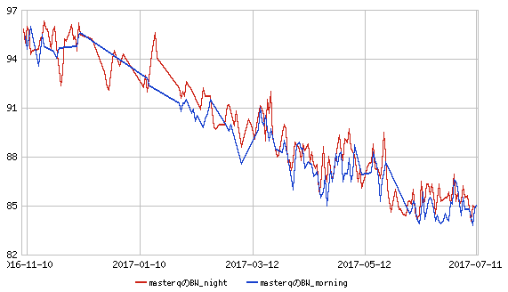
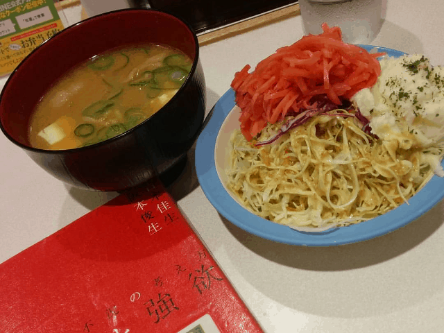
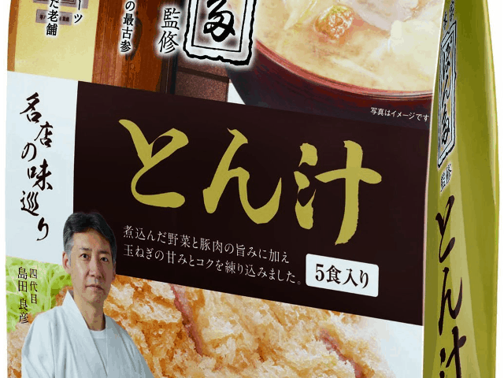
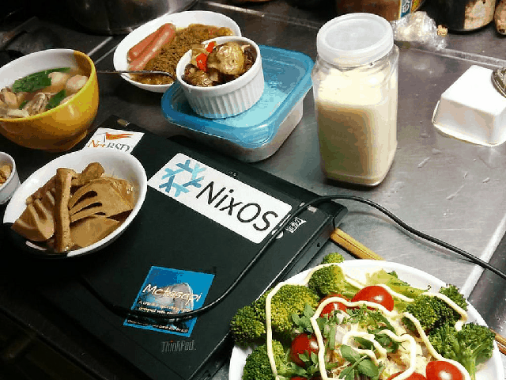

# お米大好きな組み込みエンジニアが半年で10kg限量した話

Kiwamu Okabe

# 結果

# 運動: 平日毎日1時間プールで歩く

* 出社する前に1時間プールで歩く
* 渋谷勤務なので、代官山スポーツプラザもしくはひがし健康プラザ
* 200円/日

# 食事: 朝食

* 食べたり食べなかったり
* 豆乳+牛乳+きな粉ドリンク
* チーズ

# 食事: 昼食

* 松屋
* ポテトサラダ
* とん汁
* 340円/食

# 食事: 間食

* 仕事中どうしてもお腹が空きます
* お菓子を食べてはダメ
* とん汁は飲み放題可
* https://www.amazon.co.jp/gp/product/B00N4OJ9AQ/
* "マルコメ 名店の味巡り ぽん多とん汁 5食×7袋"
* 82円/食

# 食事: 夕食を食べる順番

* 豆乳+牛乳+きな粉ドリンク
* 味噌+キュウリ
* スープ
* 豆腐
* チーズ
* 唐揚げもしくはウィンナー on もやし
* 納豆+卵+御飯

# お酒

* 家ではお酒を飲まない
* 外で蒸留酒なら飲んで良し
* なるべく糖分を取らないこと

# 寝る前に一息

* カルピスは飲み放題
* 冷たいカルピスを飲むと眠りにくくなる
* ホットカルピスに移行中

# 睡眠

* 24:30までに布団に入ること
* 布団の中でPCやスマホの画面を見ないこと(これが難しい...)
* テンピュールの寝具を購入検討中

# 習慣化

* https://habitica.com/
* 習慣化をRPGのようなゲームで達成できる

# 結論

* 一日の決まり事を決めよう
* https://habitica.com/ を使って習慣化しよう
* 家族とhabiticaレベルアップ競争をしよう
