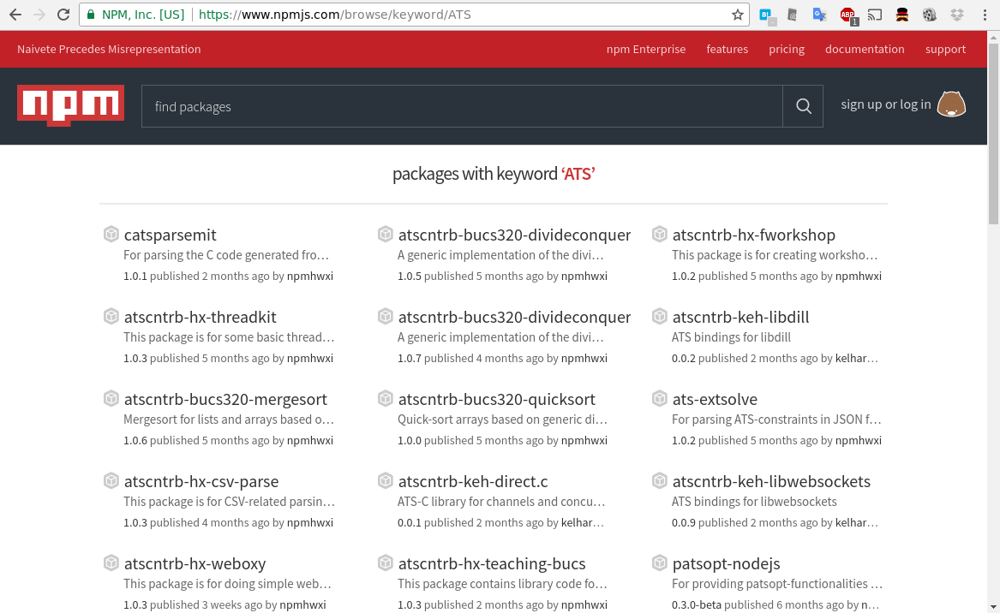
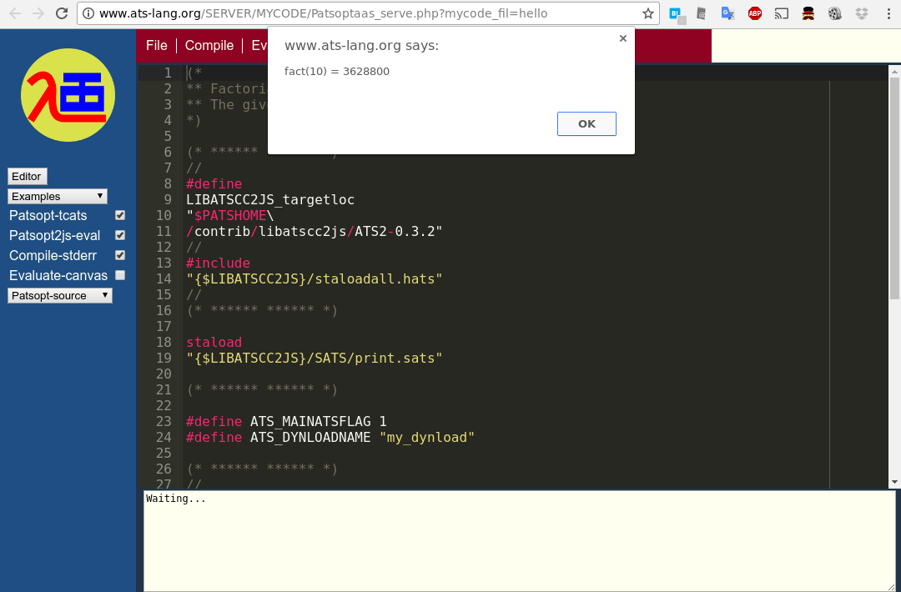

# ATS2 updates 2017


Kiwamu Okabe

# What's ATS2 language?


* http://www.ats-lang.org/
* The syntax is similar to ML
* DML-style dependent types / Linear types
* Theorem proving / Safely using pointer
* Without GC / Without runtime
* Compiled into C language code

# What's Japan ATS User Group?


* http://jats-ug.metasepi.org/
* Translating ATS documents into Japanese

~~~
* ATSプログラミング入門
  http://jats-ug.metasepi.org/doc/ATS2/INT2PROGINATS/
* ATSプログラミングチュートリアル
  http://jats-ug.metasepi.org/doc/ATS2/ATS2TUTORIAL/
* Effective ATS
  https://github.com/jats-ug/translate/blob/master/Manual/EffectiveATS.md
~~~

# But the translations are stopped...

```
$ w3m http://jats-ug.metasepi.org/doc/ATS2/INT2PROGINATS/
$ pwd
/home/kiwamu/doc/ATS-Postiats.jats-ug/doc/BOOK/INT2PROGINATS
$ git log .
--snip--
commit 88ce0cdbd5ecf38f6d30a0c5141c3263389d91b8
Author: Kiwamu Okabe <kiwamu@debian.or.jp>
Date:   Sun Nov 29 11:50:07 2015 +0900

    Some fix
--snip--
```

After November 2015, what happens at ATS2?

# ATS-extsolve using SMT solver #1

* Command patsolve_smt2 turns ATS constraints in json format into those in smt-lib2 format.
* It means that z3, cvc4 and etc can be used to type-check.
* It can handle constraints on real numbers.

# ATS-extsolve using SMT solver #2

* Example:

```
$ git clone https://github.com/githwxi/ATS-Postiats.git
$ (cd ATS-Postiats/contrib/ATS-extsolve && make)
$ (cd ATS-Postiats/contrib/ATS-extsolve-smt2 && make)
$ (cd ATS-Postiats/contrib/ATS-extsolve-z3 && make)
$ cd ATS-Postiats/contrib/ATS-extsolve-z3/TEST
$ vi fib.dats
```

```ats
#include "share/atspre_staload.hats"

stacst fib: int -> int
extern praxi fib_bas0(): [fib(0)==0] void
extern praxi fib_bas1(): [fib(1)==1] void
extern praxi fib_ind2{n:int | n >= 2}(): [fib(n)==fib(n-1)+fib(n-2)] void
```

# ATS-extsolve using SMT solver #3

```ats
fun fib {n:nat} .<n>. (n: int(n)) : int(fib(n)) = let
    fun loop {i:nat|i <= n} .<n-i>.
      (ni: int(n-i), f0: int(fib(i)), f1: int(fib(i+1))) : int(fib(n)) =
        (if ni >= 2 then let
             prval () = fib_ind2{i+2}()
           in
             loop{i+1}(ni-1, f1, f0+f1)
           end
         else (if ni >= 1 then f1 else f0)) // Can't solve `f1`!
    prval () = fib_bas0() and () = fib_bas1()
  in
    loop{0}(n, 0, 1)
  end
```

# ATS-extsolve using SMT solver #4

```ats
implement main0(argc, argv) =
{
  val n = (if (argc >= 2)
           then g0string2int(argv[1]) else 10): int
  val n = g1ofg0(n)
  val n = (if n >= 0 then n else 0): intGte(0)
  val () = println! ("fib(", n, ") = ", fib(n))
}
```

```
$ patscc -o fib fib.dats
/home/kiwamu/src/ATS-Postiats/contrib/ATS-extsolve-z3/TEST/fib.dats: 554(line=17, offs=32) -- 556(line=17, offs=34): error(3): unsolved constraint: C3NSTRprop(C3TKmain(); S2Eeqeq(S2Eapp(S2Ecst(fib); S2Eapp(S2Ecst(add_int_int); S2Evar(i(8880)), S2Eintinf(1))); S2Eapp(S2Ecst(fib); S2Evar(n(8879)))))
```

# ATS-extsolve using SMT solver #5

* But, z3 can type-check it!

```
$ patscc --constraint-ignore -o fib fib.dats
$ patsopt -tc --constraint-export -d fib.dats | ../patsolve_z3 -i
Hello from [patsolve_z3]!
typechecking is finished successfully!
$ ./fib 25
fib(25) = 75025
```

# NPM package manager for ATS2 #1

* There are many ATS2 packages at NPM.
* NPM is the package manager for JavaScript.
* https://www.npmjs.com/browse/keyword/ATS

# NPM package manager for ATS2 #2



# NPM package manager for ATS2 #3

* How to create ATS package?
* Please read following articles:

```
http://ats-lang.sourceforge.net/EXAMPLE/EFFECTIVATS/DivideConquer/main.html
http://ats-lang.sourceforge.net/EXAMPLE/EFFECTIVATS/GraphSearch-npm/main.html
```

# Better JavaScript support #1

* ATS+Emscripten run on web browser.
* Command patsopt and atscc2js can run on web browser.
* It means that you can compile ATS code into JavaScript on your browser!
* Let's open following URL:

```
http://www.ats-lang.org/SERVER/MYCODE/Patsoptaas_serve.php?mycode_fil=hello
```

# Better JavaScript support #2



# The other language support #1

* ATS has following language backends:

```
* C language
* Erlang
* JavaScript
* PHP
* Clojure
* Perl
* Python3
* Scheme
```

# The other language support #2

* Support in atscc2erl and atscc2scm for handling tail-call optimized code.
* Adding support for stream_vt in the following compilers: atscc2js, atscc2py3, atscc2scm, atscc2clj, atscc2php, atscc2pl.

# Session types

```
セッション型チャネル:概要入門
(Session-typed Channels:A Brief Introduction)
http://jats-ug.metasepi.org/doc/ATS2/EXAMPLE/EFFECTIVATS/ssntyped-channels-1/main.html

セッション型チャネル:セッションを合成しよう!
(Session-typed Channels:Let us combine sessions together!)
http://jats-ug.metasepi.org/doc/ATS2/EXAMPLE/EFFECTIVATS/ssntyped-channels-2/main.html
```

# Syntax highlighting

* Pandoc

```
https://github.com/jgm/skylighting/blob/master/xml/ats.xml
```

* DocBook

```
https://github.com/githwxi/ATS-Postiats/blob/master/doc/BOOK/INT2PROGINATS/MYTEXT/mytexting.dats
```

# Syntax: ifcase-expressions #1

```ats
(* https://github.com/githwxi/ATS-Postiats/blob/master/doc/EXAMPLE/TESTATS/ifcase.dats *)
#include "share/atspre_staload.hats"

fun acker{m,n:nat} .<m,n>. (m: int(m), n: int(n)) : intGte(0) =
  (ifcase
   | m = 0 => n + 1
   | n = 0 => acker(m-1, 1)
   | _(*else*) => acker(m-1, acker(m, n-1)))

val () = assertloc(acker(3,3) = 61)

fun foo{i:nat} (x: int(i), y: int(i+1)): void = ()
```

# Syntax: ifcase-expressions #2

```ats
implement main0 () = () where {
  var x: int
  var y: int
  val i = (2: intGte(0))
  val () = (ifcase: [i:nat] (x: int(i), y: int(i+1)) =>
            | i = 0 => (x := i; y := x+1)
            | i = 1 => (x := i; y := x+1)
            | _(*i >= 1*) => (x := 10; y := 11)): void
  val () = foo(x, y)
  val () = println! ("x = ", x, " and y = ", y)
}
```

```
$ patscc ifcase.dats
$ ./a.out
x = 10 and y = 11
```

# Support templates, more #1

* Supporting $tempenver in template implementation: This is a crucial addition in support of programming in ATS that may potentially be (very) deeply template-based!!!

```ats
(* https://github.com/githwxi/ATS-Postiats/blob/master/doc/EXAMPLE/TESTATS/tempenver.dats *)
#define ATS_PACKNAME "TEMPENVER"
#include "share/atspre_staload.hats"

extern fun{} foo(): int
extern fun{} bar1(int): int
extern fun{} bar2(int): int
```

# Support templates, more #2

```ats
implmnt{} bar1(x) = bar2(x)
implmnt{} bar2(x) = if x > 0 then foo() + bar1(x-1) else 0
implement main0(argc ,argv) = let
    implement{} foo((*void*)) = argc
    val () = $tempenver(argc)
  in
    println! ("bar2(10) = ", bar2(10))
  end
```

```
$ patscc tempenver.dats
casper$ ./a.out
bar2(10) = 10
casper$ ./a.out 100
bar2(10) = 20
```

# New parsing-combinator package

* Adding a parsing-combinator package for libats.
* Adding a parsing-combinator package for libatscc.
* It means following code?

```
https://github.com/githwxi/ATS-Postiats/tree/master/npm-utils/contrib/libats-/hwxi/parcomb
```

# ats-lang-club@googlegroups.com

* Welcome to the secret group!

```
I have just created the ats-lang-club. Membership is by invitation only. The plan is to use this group to discuss all matters, general and specific, on or related to "evangelizing" ATS. Cheers! --Hongwei
```

* They are discussing about the future of ATS language.

# AD: 簡約!? λカ娘 10


* コミックマーケット92 - 1日目 金曜日 東た11b
* At 参照透明な海を守る会
* 第1章 IST(Internal Set Theory) 入門 (後編)
* 第2章 Coqダンジョン: 底抜けの壺の夢
* 第3章 モナドとひも
* 第4章 矢澤にこ先輩と一緒にモナドモナド!
* 第5章 VeriFastチュートリアル

# License of photos


```
* Creative Commons BBB | Flickr
  https://www.flickr.com/photos/steren/2732488224/
  Copyright: Steren Giannini / License: CC BY 2.0
* Update | Model: Viktoria Derevtsova | Exey Panteleev | Flickr
  https://www.flickr.com/photos/exey/3960710978/
  Copyright: Exey Panteleev / License: CC BY 2.0
```
