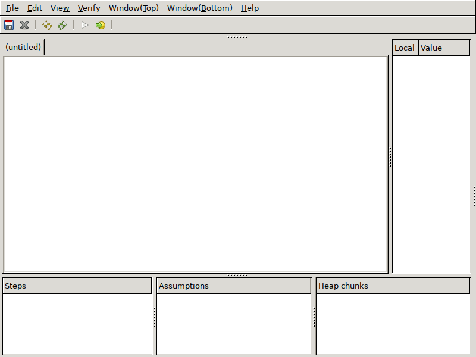
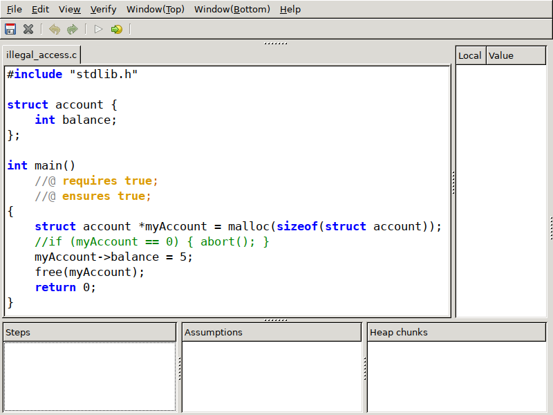
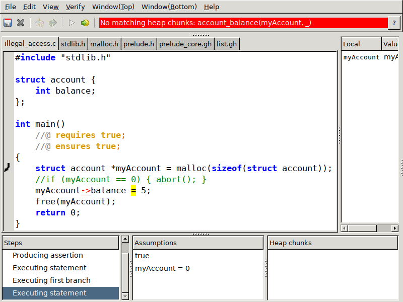
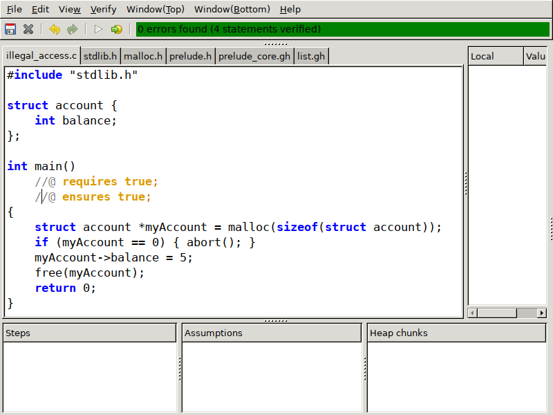
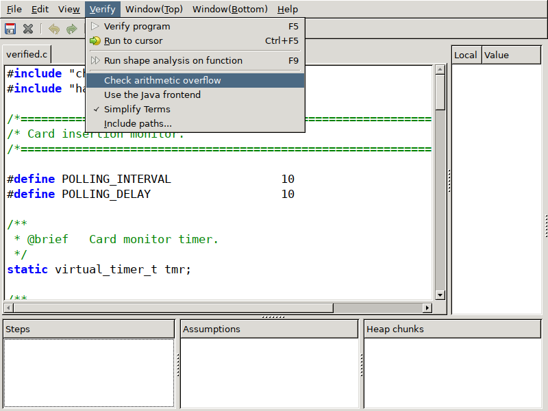
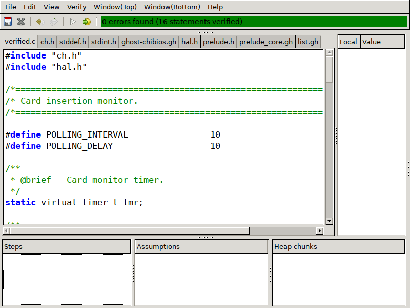
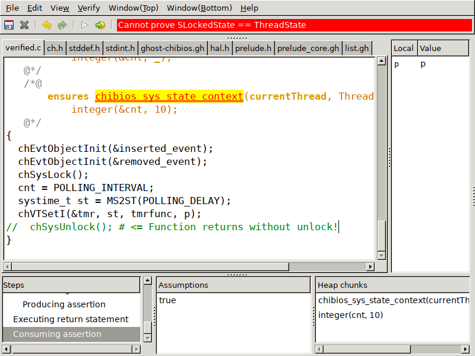

# Introduction to VeriFast @ Kyoto


Kiwamu Okabe

# Setup before this presentation

* Plesse copy following files from the USB stick.

```
chibios-verifast.tgz
illegal_access.c
verifast-nightly-osx.tar.gz
verifast-nightly.tar.gz
verifast-nightly.zip
```

# What's VeriFast?

* https://github.com/verifast/verifast
* A verifier for single-threaded and multi-threaded C and Java language programs annotated with preconditions and postconditions written in separation logic.
* VeriFast avoids illegal memory accesses such like buffer overflow.
* VeriFast is easy to use with the graphical IDE.

# Why use VeriFast? #1


# Why use VeriFast? #2


# Let's try to boot VeriFast!

```
# Windows
$ unzip verifast-nightly.zip
$ ./verifast-*/bin/vfide.exe

# Linux
$ tar xf verifast-nightly.tar.gz
$ ./verifast-*/bin/vfide

# macOS
$ tar xf verifast-nightly-osx.tar.gz
$ ./verifast-*/bin/vfide
```

# You will see VeriFast IDE window



# Open "illegal_access.c" file



# VeriFast finds an error, if verify it



# Why does the error occur?

* The malloc(3) may return NULL pointer.
* But "myAccount->balance" dereferences the pointer without checking NULL.

# Modify code, and verify it



# Example for RTOS application #1

```
$ export PATH=`pwd`/verifast-*/bin:$PATH
$ tar xf chibios-verifast.tgz
$ cd chibios-verifast/verifast_demo/STM32/RT-STM32F746G-DISCOVERY-LWIP-FATFS-USB
$ make vfide
```

# Uncheck arithmetic overflow



# Verify RTOS application



# VeriFast finds error with bad manner



# The error is caused by system state


# Conclusion

* VeriFast is easy to setup and use.
* VeriFast has own graphical IDE.
* VeriFast safely uses pointers.
* VeriFast finds violation of RTOS system state.

# For more information

```
In English:
"The VeriFast Program Verifier: A Tutorial"
https://people.cs.kuleuven.be/~bart.jacobs/verifast/tutorial.pdf

## In Japanese
"プログラム検証器 VeriFast: チュートリアル"
https://github.com/jverifast-ug/translate/blob/master/Manual/Tutorial/Tutorial.md

"TPPMark2016 を解きながら学ぶ VeriFast"
https://speakerdeck.com/eldesh/tppmark2016-wojie-kinagaraxue-bu-verifast

"VeriFast Termination Checking Introduction(α)"
https://speakerdeck.com/eldesh/verifast-termination-checking-introduction-a
```

# Meetup at Osaka tomorrow


* "#静的コード解析の会 第4回@大阪"
* https://metasepi.connpass.com/event/55350/
* Some talks about "static code analysis"
* Hands-on VeriFast with STM32 microcontroller

# 簡約!? λカ娘10 @ 参照透明な海を守る会


* コミックマーケット92 - 1日目 金曜日 東た11b
* http://www.paraiso-lang.org/ikmsm/books/c92.html

```
* 第1章 モナドとひも
* 第2章 矢澤にこ先輩と一緒にモナドモナド!
* 第3章 Coqダンジョン: 底抜けの壺の夢
* 第4章 IST(Internal Set Theory) 入門 (後編)
* 第5章 静的コード解析はいいぞ!
* 第6章 VeriFastチュートリアル
````

# License of photos


```
* Creative Commons BBB | Flickr
  https://www.flickr.com/photos/steren/2732488224/
  Copyright: Steren Giannini / License: CC BY 2.0
* kindle paperwhite 3G | Kindle paperwhite... | Tatsuo Yamashita | Flickr
  https://www.flickr.com/photos/yto/8197280407/
  Copyright: Tatsuo Yamashita / License: CC BY 2.0
* Kyoto | Japan | Pedro Szekely | Flickr
  https://www.flickr.com/photos/pedrosz/34993395402/
  Copyright: Pedro Szekely / License: CC BY-SA 2.0
```
