# Past and future of Metasepi project


Kiwamu Okabe

# Started on the experience at Ricoh
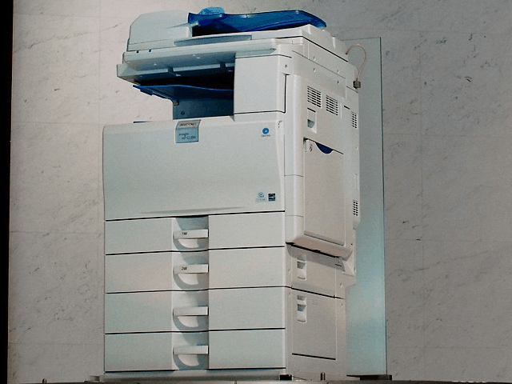

* I worked at Ricoh Company, Ltd. to develop embedded devices.
* The device is a Multi Function Printer, which is based on NetBSD OS.
* My team doesn't only create device drivers,
* but also add original functions into the OS core.

# Issues between OSS and product #1


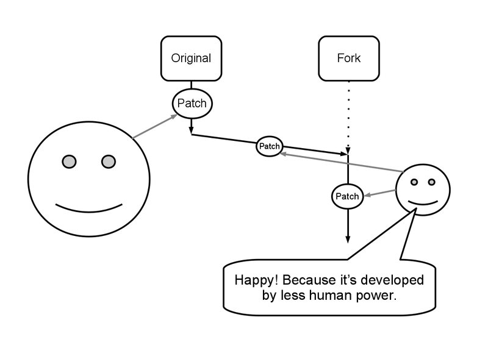

# Issues between OSS and product #2


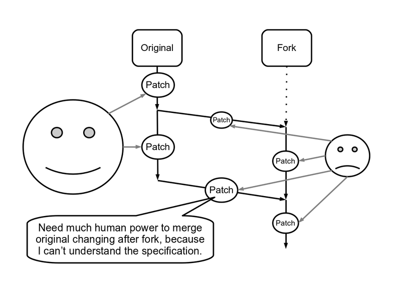

# Issues between OSS and product #3


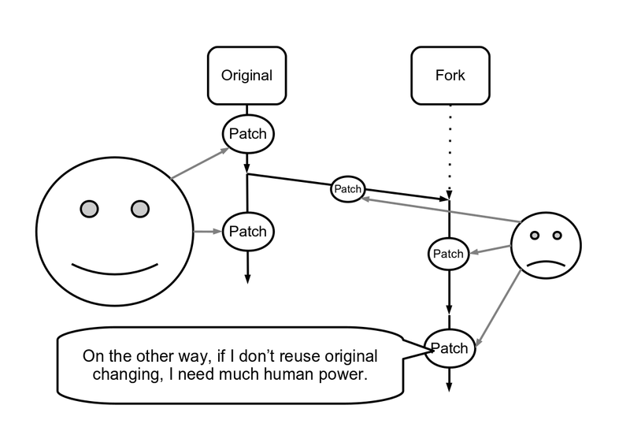

# Issues between OSS and product #4


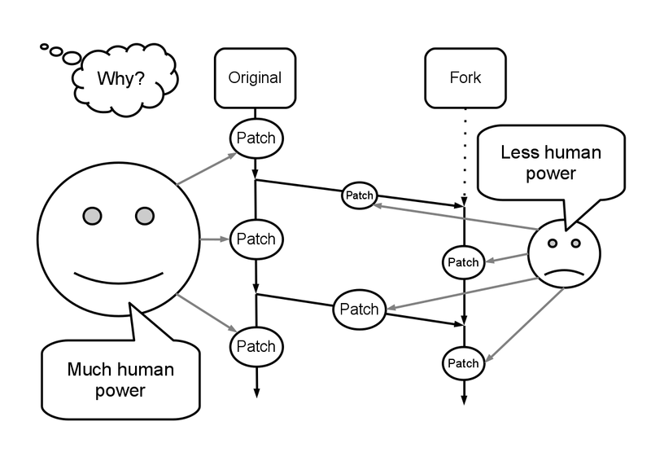

# Issues between OSS and product #5


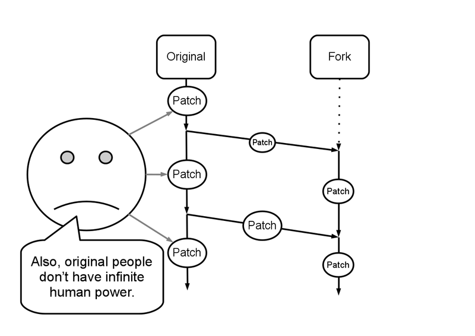

# What's the root of such issues?


* Such issues are runtime errors, which are caused without sharing the specification.
* Specification =~ {Meaning, Invariant}
* If well specification is shared in people,
* we can understand new code and changing.
* Such specification is located at human's brain, and volatilized after writing code.

# Iceberg of errors


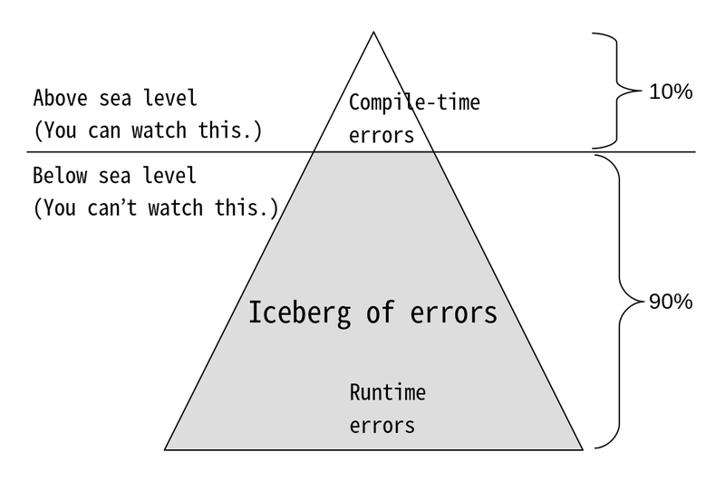

# How about watch more iceberg?


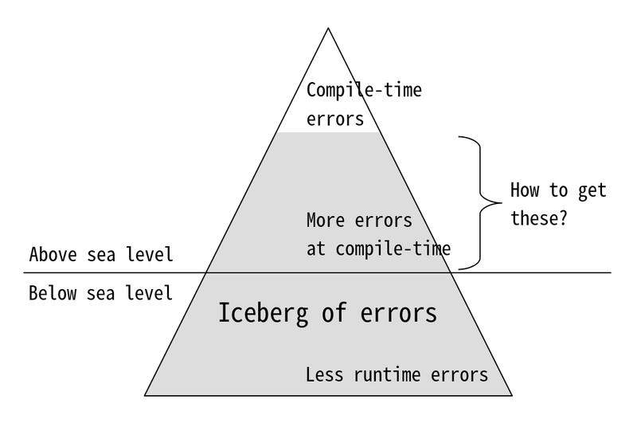

# Microsoft commits quality of software


* Static Driver Verifier

```
https://docs.microsoft.com/en-us/windows-hardware/drivers/devtest/static-driver-verifier
"Static Driver Verifier is a static verification tool that systematically analyzes the source code of Windows kernel-mode drivers."
```

* VCC: A Verifier for Concurrent C

```
https://github.com/Microsoft/vcc
"The current primary goal of the VCC project is to verify Microsoft Hyper-V."
```

* Why is there no solution for OSS product?

# Metasepi Project


* http://metasepi.org/
* Idea: Strong types can capture specification.
* Goal: Create Unix-like OS with strong type.
* Challenge: Find such type systems on science and engineering, and write practical code.

# 1st iteration: Ajhc Haskell compiler


* John Meacham creates own Haskell compiler, named "jhc".
* http://repetae.net/computer/jhc/
* I forked jhc to be customized embedded system.
* The compiler is called "Ajhc".
* http://ajhc.metasepi.org/

# How does Ajhc work?


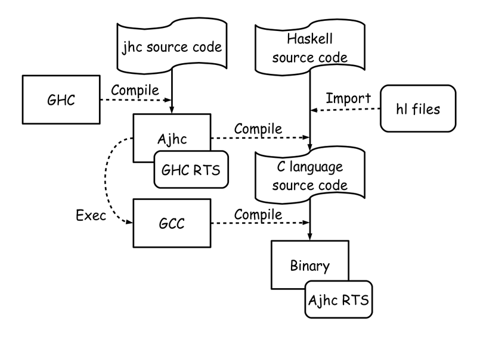

# 1st iteration: Plan for kernel


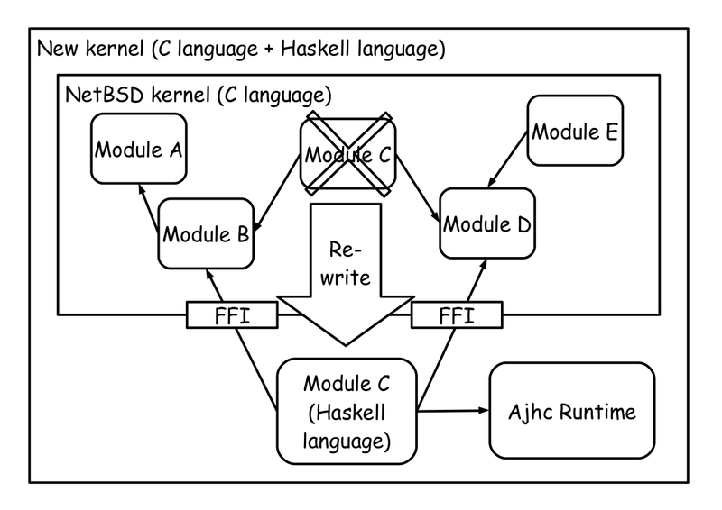

# Ajhc for multitask and interrupt


```
"Systems Demonstration: Writing NetBSD Sound Drivers in Haskell."
http://metasepi.org/doc/metasepi-icfp2014-demo.pdf
```

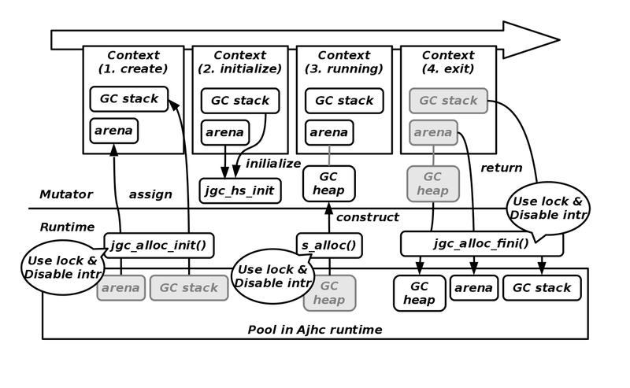

# App: Haskell code runs on ARM MCU


* http://youtu.be/C9JsJXWyajQ

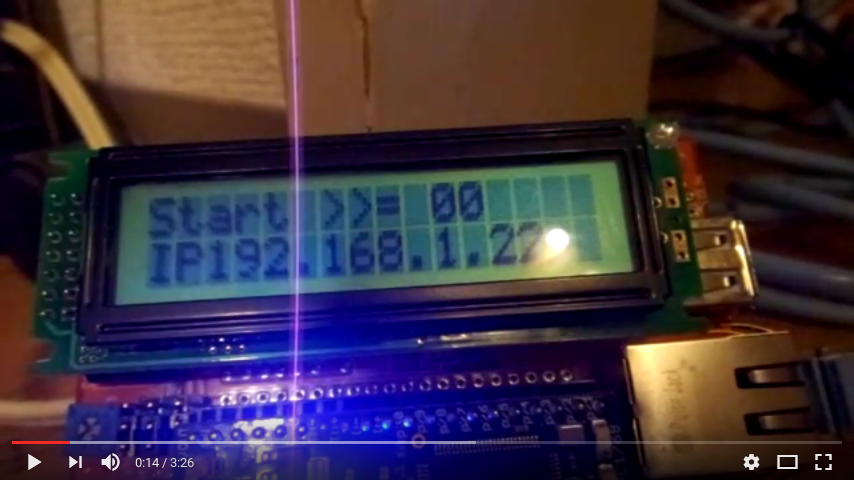

# App: Haskell code runs on Android NDK


* http://youtu.be/n6cepTfnFoo

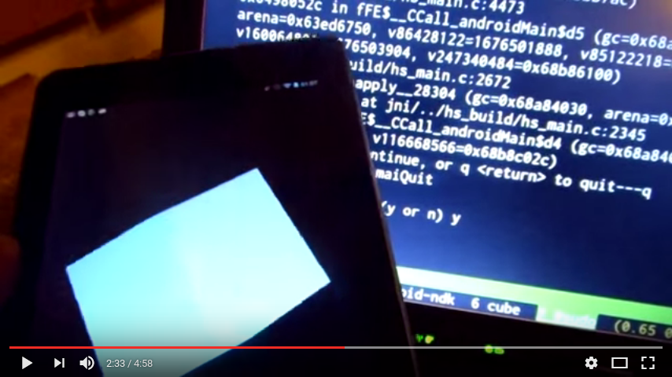

# App: Audio driver written by Haskell


* http://youtu.be/E30ZvEVExI0

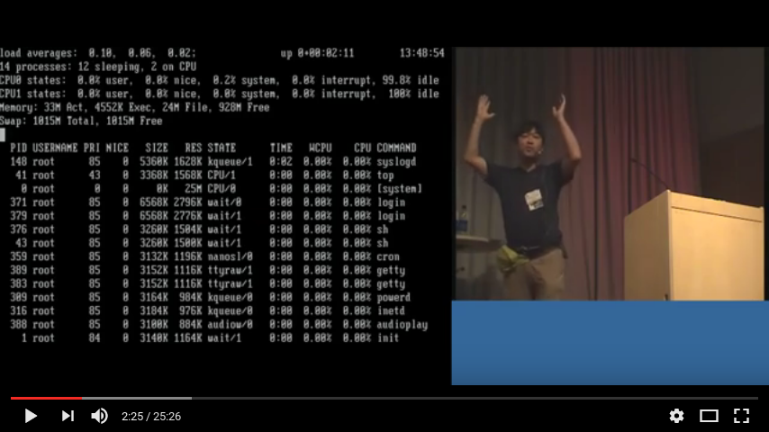

# 1st iteration: Keep/Problem/Try


Keep

* Languages other than C can effectively write kernel code.

Problem

* Haskell thunk easily eats large memory.

Try

* Should find system language without GC.

# 2nd iteration: ATS language


* http://www.ats-lang.org/
* ATS is developed at Boston University.
* ATS can prove the code with dependent types.
* ATS code can run without GC.
* I found "Japan ATS User Group" to translate documents into Japanese.
* http://jats-ug.metasepi.org/

# How does ATS work?


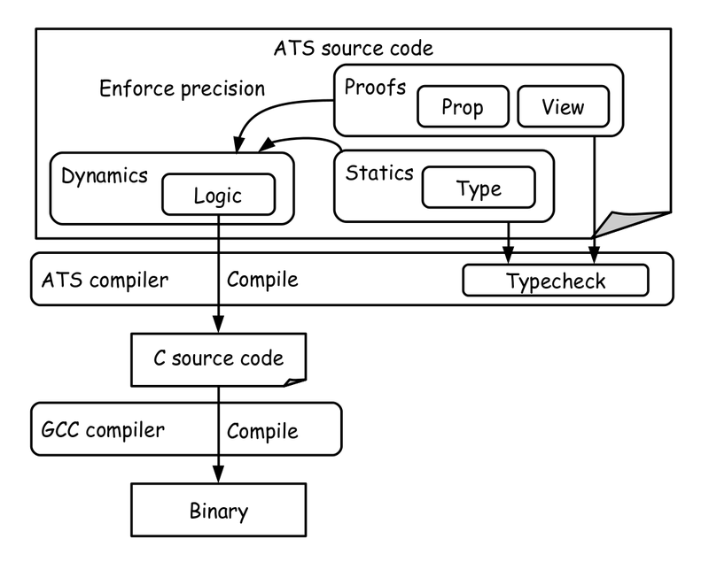

# 2nd iteration: Plan for kernel


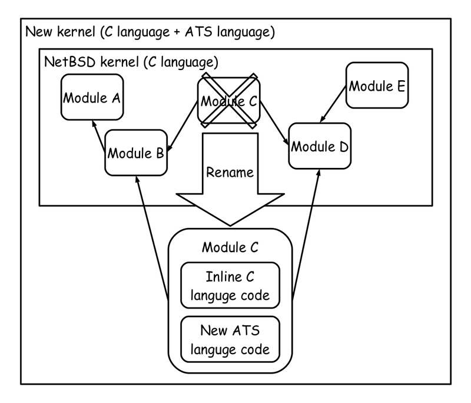

# App: ATS code runs on 8bit AVR


* http://youtu.be/5uPue0Jo1nc

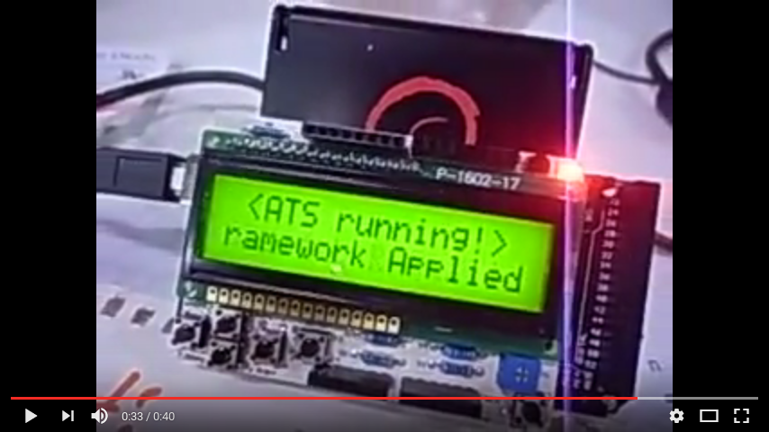

# App: Capture state on RTOS


* https://github.com/fpiot/chibios-ats-2


# Tool: Generate ATS interface from C


* https://github.com/metasepi/c2ats

```c
/* C language */
FILE *fopen(const char *pathname, const char *mode);
size_t fread(void *ptr, size_t size, size_t nmemb, FILE *stream);
```

```
↓
```

```ats
(* ATS language *)
fun fun_c2ats_fopen: {l1,l2:addr} (!ptr_v_1(char, l1), !ptr_v_1(char, l2) | ptr l1, ptr l2) -> [l3:addr] (ptr_v_1(type_c2ats_FILE, l3) | ptr l3) = "mac#fopen"
fun fun_c2ats_fread: {l1:addr} (!ptr_v_1(type_c2ats_FILE, l1) | ptr, type_c2ats_size_t, type_c2ats_size_t, ptr l1) -> type_c2ats_size_t = "mac#fread"
```

# 2nd iteration: Keep/Problem/Try


Keep

* Linear types safely uses pointer without GC.

Problem

* Rewriting existing C code with ATS needs much human power.

Try

* Apply specification to code without rewriting.

# 3rd iteration: VeriFast verifier


* https://github.com/verifast/verifast
* VeriFast is developed at KU Leuven.
* VeriFast verifies pre/postcondition in comment.
* VeriFast is for C and Java language.
* I translated VeriFast tutorial into Japanese.

```
https://github.com/jverifast-ug/translate/blob/master/Manual/Tutorial/Tutorial.md
```

# How does VeriFast work?


xxx

# 3rd iteration: Plan for kernel


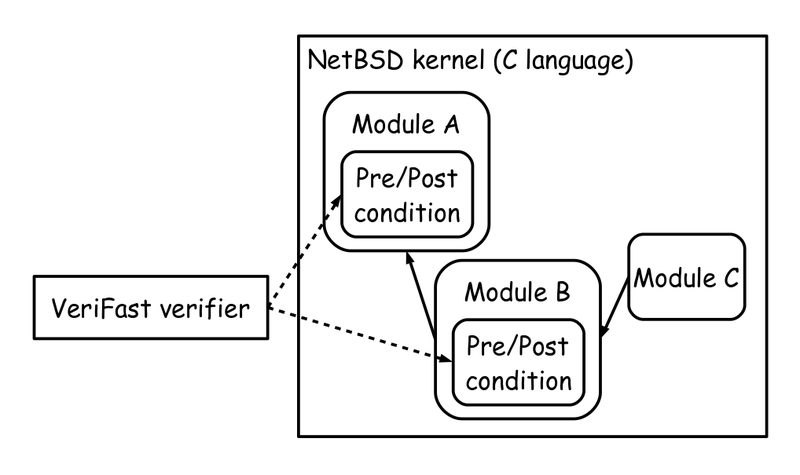

# App: Capture state on RTOS


```
https://github.com/fpiot/chibios-verifast
https://www.slideshare.net/master_q/poster-comparing-ats-and-verifast-on-rtos-system-state
```

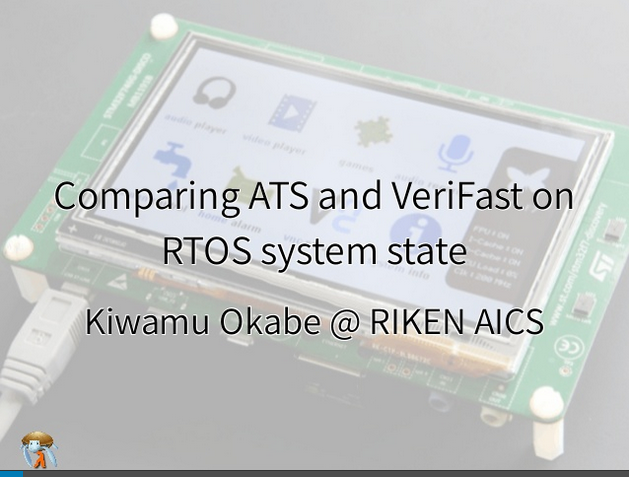

# Today's choice: Type or Verification?


* ATS: Type system in new language can capture invariant in the code.
* VeriFast: Verification in comment of existing language can apply specification onto the code.
* "Faced with a choice, do both" -- Dieter Rot

# Future of Metasepi

xxx

# License of photos #1


```
* Creative Commons BBB | Flickr
  https://www.flickr.com/photos/steren/2732488224/
  Copyright: Steren Giannini / License: CC BY 2.0
* @ Ricoh, 2009/02/19 | In the lobby, the latest MFP, a multi … | Flickr
  https://www.flickr.com/photos/raitank/3292620200/
  Copyright: raitank / License: CC BY 2.0
* Rooted | Trees growing out of things FTW! … | Jody McIntyre | Flickr
  https://www.flickr.com/photos/scjody/4705083069/
  Copyright: Jody McIntyre / License: CC BY-SA 2.0
* Iceberg! | Christopher Michel | Flickr
  https://www.flickr.com/photos/cmichel67/8371340296/
  Copyright: Christopher Michel / License: CC BY 2.0
* Bill Gates @ the University of Waterloo | Bill Gates enthral… | Flickr
  https://www.flickr.com/photos/batmoo/61938659/
  Copyright: Mohammad Jangda / License: CC BY-SA 2.0
```

# License of photos #2


```
* Hooded Cuttlefish | Indonesia July 2007 | Silke Baron | Flickr
  https://www.flickr.com/photos/silkebaron/931247866/
  Copyright: Silke Baron / License: CC BY 2.0
* Hooded Cuttlefish | Indonesia July 2007 | Silke Baron | Flickr
  https://www.flickr.com/photos/silkebaron/931381358/
  Copyright: Silke Baron / License: CC BY 2.0
* Javi Recio y David Cabrera | Otakumunidad Damned | Flickr
  https://www.flickr.com/photos/otakumunidad/5787704531/
  Copyright: Otakumunidad Damned / License: CC BY 2.0
* ESAT KULeuven | Pues aquí es donde trabajo durante estos mes… | Flickr
  https://www.flickr.com/photos/juanvvc/4688054880/
  Copyright: Juan V. Vera del Campo / License: CC BY-SA 2.0
* The fork in the road | 例の分かれ道 | i_yudai | Flickr
  https://www.flickr.com/photos/y_i/2330044065/
  Copyright: i_yudai / License: CC BY-SA 2.0
```
