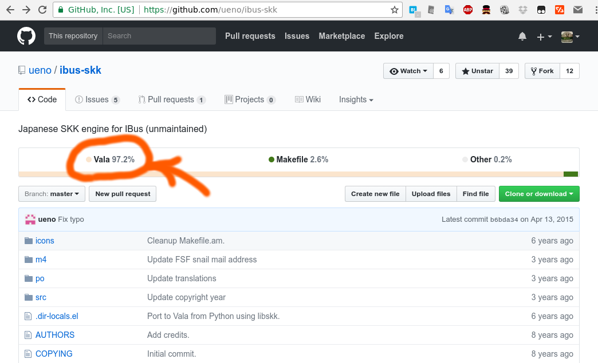

# Vala is a safe language?

Kiwamu Okabe

# There are three main platform

xxx

# World is stained with some cultures

xxx

# Culture: JVM

xxx

# Culture: .NET

xxx

# Culture: Qt

xxx

# Culture: GTK

xxx

# What's Vala?

* https://wiki.gnome.org/Projects/Vala
* Object-oriented programming language.
* Generate C code and uses the GObject system.

# How to use? #1

```
$ vi hello.vala
class Demo.HelloWorld : GLib.Object {
    public static int main(string[] args) {
        stdout.printf("Hello, World\n");
        return 0;
    }
}
$ valac hello.vala
$ ./hello
Hello, World
```

# How to use? #2

```
$ valac -C hello.vala
$ cat hello.c
--snip--
#include <glib.h>
#include <glib-object.h>
#include <stdlib.h>
#include <string.h>
#include <stdio.h>
--snip--
int main (int argc, char ** argv) {
#if !GLIB_CHECK_VERSION (2,35,0)
        g_type_init ();
#endif
        return demo_hello_world_main (argv, argc);
}
--snip--
```

# Example: ibus-skk



# Vala language is safe?

* Let's check it!

# String

```
class Demo.HelloWorld : GLib.Object {
    public static int main(string[] args) {
        int a = 6, b = 7;
        string s = @"$a * $b = $(a * b)\n";
        stdout.printf(s);                       // => "6 * 7 = 42"
        string greeting = "hello, world";
        stdout.printf("%s\n", greeting[7:12]);  // => "world"
        bool bf = bool.parse("false");          // => false
        int i = int.parse("-52");               // => -52
        double d = double.parse("6.67428E-11"); // => 6.67428E-11
        string s1 = true.to_string();           // => "true"
        string s2 = 21.to_string();             // => "21"
        return 0;
    }
}
```

# Memory leak #1

```
$ vi memory_leak.vala
class Demo.HelloWorld : GLib.Object {
    public static int main(string[] args) {
        List<string> list = new List<string> ();
        list.append ("1. entry");
        return 0; // Without free list
    }
}
$ valac -C memory_leak.vala
```

# Memory leak #2

```
$ cat memory_leak.c
--snip--
gint demo_hello_world_main (gchar** args, int args_length1) {
        gint result = 0;
        GList* list = NULL;
        gchar* _tmp0_;
        list = NULL;
        _tmp0_ = g_strdup ("1. entry");
        list = g_list_append (list, _tmp0_);
        result = 0;
        __g_list_free__g_free0_0 (list);
        return result;
}
--snip--
```

# NULL pointer dereference

```
$ vi null_pointer.vala
class Demo.HelloWorld : GLib.Object {
    public static int main(string[] args) {
        Array<string> array = null;
        stdout.printf("%s\n", array.index(0));
        return 0;
    }
}
$ valac null_pointer.vala -o app
$ ./app
Segmentation fault
```

# Buffer overflow

```
$ vi buffer_overflow.c
class Demo.HelloWorld : GLib.Object {
    public static int main(string[] args) {
        int[] a = new int[10];
        a[100000000] = 1;
        return 0;
    }
}
$ valac buffer_overflow.vala -o app
$ ./app
Segmentation fault
```

# Arithmetic overflow

```
$ vi arithmetic_overflow.vala
class Demo.HelloWorld : GLib.Object {
    public static int main(string[] args) {
        int a = 1879048192;
        int b = 1879048192;
        stdout.printf("a + b = %d\n", a + b);
        return 0;
    }
}
$ valac arithmetic_overflow.vala -o app
$ ./app
a + b = -536870912
```

# Double lock

```
$ vi double_lock.vala
class Demo.HelloWorld : GLib.Object {
    public static int main(string[] args) {
        Mutex mutex = Mutex ();
        mutex.lock ();
        mutex.lock (); // <== Freeze!
        mutex.unlock ();
        return 0;
    }
}
$ valac --thread double_lock.vala -o app
$ ./app # <== Not terminate!
```

# Forget unlock

```
$ vi forget_unlock.vala
class Demo.HelloWorld : GLib.Object {
    public static int main(string[] args) {
        Mutex mutex = Mutex ();
        mutex.lock ();
        // mutex.unlock ();
        return 0;
    }
}
$ valac --thread forget_unlock.vala -o app
$ ./app 
g_mutex_clear() called on uninitialised or locked mutex
Aborted
```

# Conclusion

* Vala is a better C language on GObject.
* Vala code is smaller than C code.
* Vala has a better string library than C.
* Vala avoids forgetting free using automatic reference counting.
* The others are UNSAFE as same as C.
