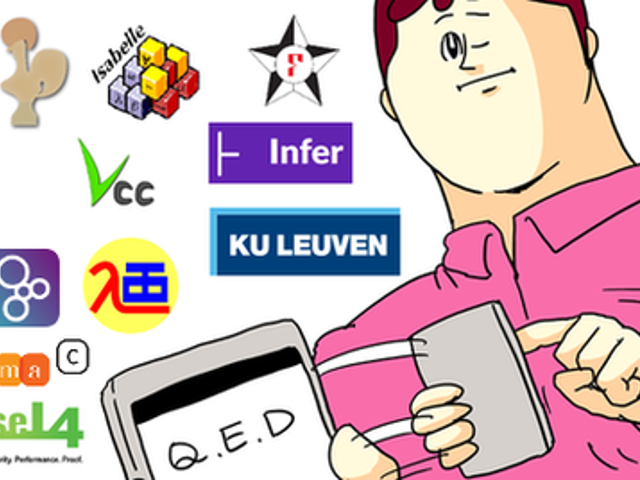

# A OCaml newbie meets Camlp4 parser

Kiwamu Okabe

# Why use Camlp4 parser?

* Why not use the Menhir as parser?
* Because VeriFast verifier uses Camlp4 parser.
* https://github.com/verifast/verifast

# What is VeriFast verifier?

xxx

# Why modify VeriFast parser?

xxx

# What is a near-term goal?

* Verify "kern/subr_optstr.c" file in NetBSD kernel:

```
$ sh build.sh -U -u -j 4 -T obj/tooldir -m amd64 tools
$ sh build.sh -U -u -j 1 -T obj/tooldir -m amd64 kernel=GENERIC
$ vfide -D __STDC__ -D __GNUC__ -D _KERNEL -D __ELF__ -D NO_KERNEL_RCSIDS -I sys -I sys/arch/amd64/compile/obj/GENERIC sys/kern/subr_optstr.c
```

* The kernel code is found at following:
* https://github.com/IIJ-NetBSD/netbsd-src

# Original verifier

xxx Screen shot

# Modified verifier

xxx Screen shot

# My patches

```
* Parse semicolon without any declarations #121
  https://github.com/verifast/verifast/pull/121
* Allow hardtab in string literals #120
  https://github.com/verifast/verifast/pull/120
* Ignore inline keyword at static function declaration #119
  https://github.com/verifast/verifast/pull/119
* Support operators in macros / Add -D option #116
  https://github.com/verifast/verifast/pull/116
```

# Knowledge to debug parser #1

xxx

# But patch may introduce unsoundness

```
$ cat verifast/soundness.md
--snip--
- We currently assume the same macros are defined on the command line when verifying the various modules that include a particular header file. (Otherwise, different modules may interpret the same header file differently.) TODO: Record the defined macros in the .vfmanifest?
```

# Ads: 静的コード解析の会 第7回


* The meeting will be held on 2018-05-12.
* https://metasepi.connpass.com/event/77398/
* Discussing about following static code analysis technology:

```
ATS, B-Method, CBMC, Coq, Coverity Scan, CSP, Dafny, F*, Frama-C, FreeSafeTy, Infer, Isabelle, SATABS, SPARK, Spin, Uppaal, VDM, VeriFast, Why3, boogie, cogent, corral, seL4, vcc, etc.
```

* We are calling for presentation.

# Ads: Functional Ikamusume book


* You can buy a latest issue from Toranoana.

```
http://www.toranoana.jp/mailorder/article/04/0030/58/73/040030587376.html
```

* And we are calling for article on Comiket 94.
* The abstract deadline is 2018-06-24.
* Please read following about CFA:
* https://wiki.haskell.org/Books#Joke

