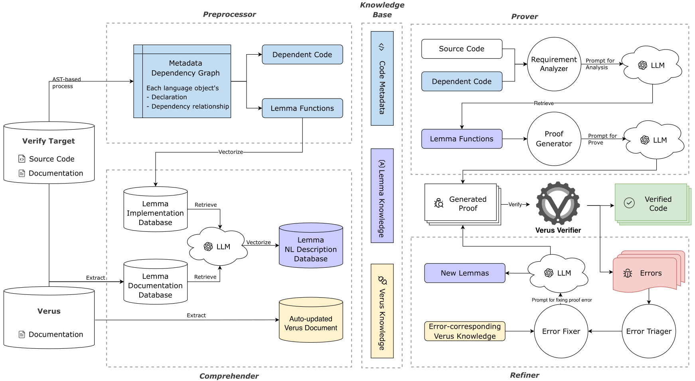

# AsterinasとVerusではじめるOSレベル検証の紹介

Kiwamu Okabe
kiwamu@metasepi.org
https://metasepi.org/

---

# Asterinas building a Linux-compatible kernel in Rust

https://github.com/asterinas/asterinas

> Asterinas pioneers the framekernel architecture, combining monolithic-kernel performance with microkernel-inspired separation. **Unsafe Rust** is confined to a small, auditable framework called [OSTD](https://asterinas.github.io/api-docs-nightly/ostd/), while the rest of the kernel is written in safe Rust, keeping the memory-safety TCB intentionally minimal.

---

# Formal Verification of Asterinas OSTD with Verus

https://github.com/asterinas/vostd

> The **vostd** project provides a formally-verified version of **OSTD**, the (unofficial) standard library for OS development in safe Rust. OSTD encapsulates low-level hardware interactions—which require **unsafe Rust**—into a small set of high-level, safe abstractions, enabling complex, general-purpose OSes like Asterinas to be written entirely in **safe Rust**. By design, OSTD guarantees soundness: no undefined behavior is possible regardless of how its API is used. The goal of vostd is to bolster this soundness through formal verification with [Verus](https://github.com/verus-lang/verus).

---

# Verus verifying Rust for low-level systems code

https://github.com/verus-lang/verus

> Verus is a tool for verifying the correctness of code written in Rust. Developers write **specifications** of what their code should do, and Verus **statically checks** that the executable Rust code will always satisfy the specifications for all possible executions of the code. Rather than adding run-time checks, Verus instead relies on powerful solvers to prove the code is correct.

---

# VOSTDのアドレスを境界にそろえるコード(抜粋)

```rust
$ cd ~/src/vostd
$ vi ostd/libs/align_ext/src/lib.rs
                #[inline]
                #[verus_spec(ret =>
                    requires
                    /// -- snip proof --
                    ensures
                    /// -- snip proof --
                )]

                /// ## Postconditions
                /// - `align` is a power of two `>= 2` (panic-enforced; the
                ///   function panics on invalid `align`, so a returning call
                ///   guarantees validity).
                /// - The return value is the greatest number that is smaller
                ///   than or equal to `self` and is a multiple of `align`.
                fn align_down(self, align: Self) -> Self {
                    /// -- snip proof --
                    self & !(align - 1)
                }
```

---

# VOSTDに意図的に不具合を混入してみる

```diff
$ git diff | cat
diff --git a/ostd/libs/align_ext/src/lib.rs b/ostd/libs/align_ext/src/lib.rs
index 3640e7c7c..288a0e4e6 100644
--- a/ostd/libs/align_ext/src/lib.rs
+++ b/ostd/libs/align_ext/src/lib.rs
@@ -212,7 +212,7 @@ macro_rules! impl_align_ext {
                         assert((self & !mask) as nat == nat_align_down(self as nat, align as nat));
                         lemma_nat_align_down_sound(self as nat, align as nat);
                     }
-                    self & !(align - 1)
+                    self & (align - 1)
                 }
         }
             )*
```

---

# VOSTDをVerusで検査すると...

```
$ make verify
--snip--
error: postcondition not satisfied
   --> ostd/libs/align_ext/src/lib.rs:186:25
    |
186 |                           ret % align == 0,
    |                           ^^^^^^^^^^^^^^^^ failed this postcondition
...
215 |                       self & (align - 1)
    |                       ------------------ at the end of the function body
...
222 | / impl_align_ext! {
223 | |     u8,
224 | |     u16,
225 | |     u32,
226 | |     u64,
227 | |     usize,
228 | | }
    | |_- in this macro invocation
    |
    = note: this error originates in the macro `impl_align_ext` (in Nightly builds,...)
```

---

# 検査エラーメッセージの意味は？

```rust
                    ensures
                        align >= 2,
                        is_pow2(align as int),
                        ret <= self,
                        ret % align == 0, /// the postcondition
```

Above violates following.

```rust
                fn align_down(self, align: Self) -> Self {
                    /// -- snip proof --
                    self & (align - 1) /// may be zero
                }
```

---

# でも証明コードを全部手書きするのは大変

```rust
                #[inline]
                #[verus_spec(ret =>
                    requires
                        (is_pow2(align as int) && align >= 2) || may_panic(),
                    ensures
                        align >= 2,
                        is_pow2(align as int),
                        ret <= self,
                        ret % align == 0,
                        ret == nat_align_down(self as nat, align as nat),
                        forall |n: nat|  !(n<=self && #[trigger] (n % align as nat) == 0) || (ret >= n),
                )]

                /// ## Postconditions
                /// - `align` is a power of two `>= 2` (panic-enforced; the
                ///   function panics on invalid `align`, so a returning call
                ///   guarantees validity).
                /// - The return value is the greatest number that is smaller than or equal to `self` and is a multiple of `align`.
                fn align_down(self, align: Self) -> Self {
                    vstd_extra::assert!(align.is_power_of_two() && align >= 2);
                    proof!{
                        is_pow2_equiv(align as int);
                        lemma_low_bits_mask_values();
                        let mask = (align - 1) as Self;
                        let e = choose |e: nat| pow(2, e) == align;
                        lemma_pow2(e);
                        assert(e < $uint_type::BITS) by {
                            if e >= $uint_type::BITS {
                                lemma_pow2_strictly_increases($uint_type::BITS as nat, e);
                                lemma2_to64();
                            }
                        }
                        call_lemma_low_bits_mask_is_mod!($uint_type, self, e);
                        assert(self == (self & mask) + (self & !mask)) by (bit_vector);
                        assert((self & !mask) as nat == nat_align_down(self as nat, align as nat));
                        lemma_nat_align_down_sound(self as nat, align as nat);
                    }
                    self & !(align - 1)
                }
```

---

# KVerus, LLM-assisted workflow for Verus proof



---

# 宣伝: 組み込み言語TakibiとLinux互換kernel

https://github.com/takibi-lang/takibi

OCaml / LLVM IR / LLMで組み込み言語を作り、その言語でLinux互換kernelを作る
"Detect errors at compile time."
Alpine Linuxで配布しているBusyBox実行バイナリでHTTPサーバが動作
マルチコアサポートを実装中

詳細はブログで! https://metasepi.org/en/tags/takibi.html
